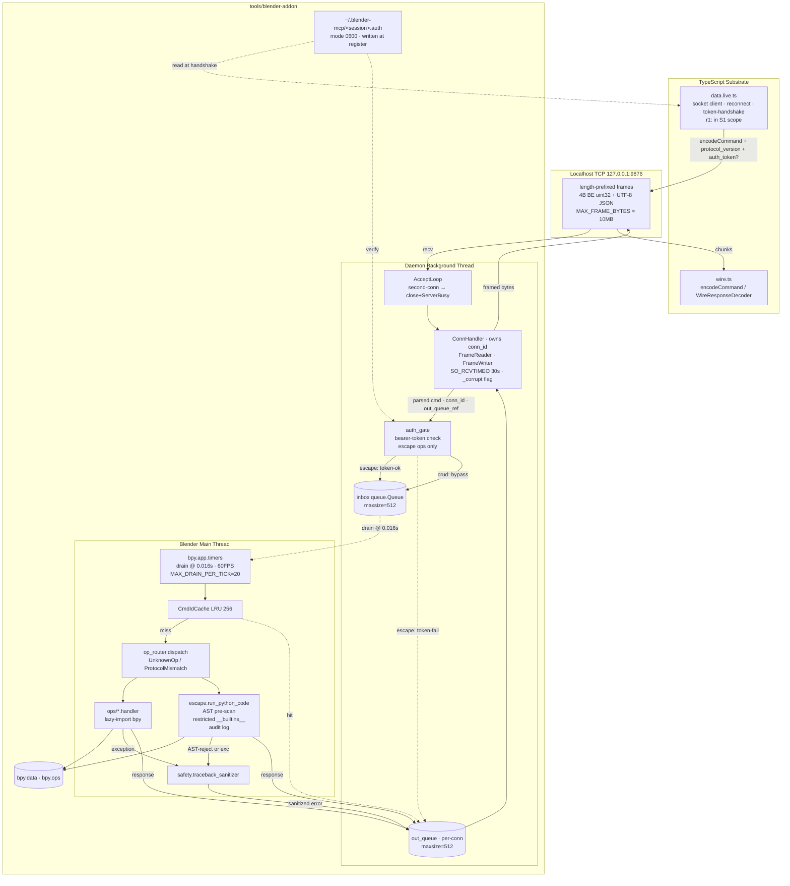
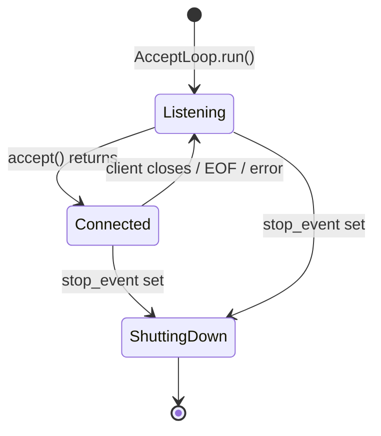

# SDD · Blender Adapter · Python Addon (v0)

> Translates `prd.md` FR-1..FR-13 into module-level design. Minimal-mode SDD. Section §3 resolves the 5 Q-SDD-* questions; everything else is the module shape + interfaces engineers need to start S0/S1.

## 0. Scope of This Document

> **⚠️ r2 · 2026-05-19 · GLOBAL SUPERSEDE**: This SDD was authored at r1 with the FR-12 escape hatch in scope. **FR-12 is deferred to v1** (operator decision 2026-05-19 · see Revision Notes r2 + companion PRD r2). **Every reference below to FR-12 / `run_python_code` / `escape.py` / `lib/ops/escape.py` / `lib/safety/timeout.py` / the auth-gate / bearer tokens / `~/.blender-mcp/` / `auth_token` / `BLENDER_MCP_ENABLE_ESCAPE` / Q-SDD-8 / Q-SDD-9 / AP-7 is SUPERSEDED** — retained verbatim as v1 design input, NOT a v0 requirement. The normative v0 module shape is `sprint.md` r3 Appendix D. r2 also adopts: `lib/wire/` is a package (not flat `wire.py`); schema source-of-truth at `lib/wire/wire.schema.json` exported from TS Effect Schema; Python validation is stdlib-only (no `jsonschema`). **r2 environment retarget (S0 calibration 2026-05-19)**: target is **Blender 5.1.x / Python 3.13**, NOT the 4.5 LTS / 3.11 r1 assumed — every "4.5 LTS" / "Python 3.11" reference below is superseded. S0's 4 calibration probes all PASSED on 5.1.1 (echo round-trip · 60 FPS timer p99 ≈ 0.07 ms · `temp_override` reachable from timer cb · multi-file package loads) — see `cycles/blender-adapter-2026-05-18/sprint-0-COMPLETED.md`.

In scope:
- Module + class shape inside `tools/blender-addon/` (PRD §5.3 · **normative tree: sprint.md r3 Appendix D**)
- Threading model (FR-4, FR-5, FR-6) end-to-end
- Wire framing on the Python side (FR-1, FR-2, FR-3)
- Op-handler registry + 5 CRUD handlers (FR-7..FR-11) — **r2: escape hatch FR-12 removed from v0 scope**
- Resolution of open questions Q-SDD-1..Q-SDD-7, Q-SDD-10, Q-SDD-11 (**Q-SDD-8 + Q-SDD-9 moot — FR-12 deferred**)
- Testing strategy that reaches PRD §5.5 coverage target (≥85%)

Out of scope (pushed to sprint plan or v1+):
- Concrete op-handler bodies beyond signatures (sprint task)
- Operator/Context/NodeGraph/Asset seams (PRD §6.2)
- MCP protocol export (PRD §6.2)
- ~~TS-side `data.live.ts` design~~ **r1: NOW IN SCOPE** — promoted from PRD R-4 to S1 deliverable per PRD-flatline IMP-001. Design covered in this SDD §2.3 (new).

## Revision Notes (r1 · 2026-05-18)

Integrates 10 high-consensus + 11 blocker findings from `a2a/flatline/sdd-review.json` (76% agreement · 3-model: codex + claude + gemini · full confidence). Composes with PRD r1 revision notes.

| Finding | Source | r0 issue | r1 resolution (where applied below) |
|---|---|---|---|
| **RESP-CORRELATION** | IMP-004 (875) + SKP-002 PRD (855) | Single shared `outbox` queue → reconnecting client receives responses to commands it never issued | §1.1 mermaid revised · §1.2 threading section rewritten · §2.2 ConnHandler owns per-connection `out_queue` · §3.6 Q-SDD-6 new |
| **QUEUE-BACKPRESSURE** | SKP-001 (CRIT 870) + IMP-005 (845) + SKP-001 main-thread-freeze (CRIT 850) | `queue.Queue()` defaults to unbounded · main-thread `put()` on bounded queue freezes UI | §2.2 wire constants `MAX_QUEUE_SIZE=512` · main-thread `put_nowait` + drop-and-close-connection on `queue.Full` · §1.2 threading section |
| **MAX-FRAME-BYTES** | SKP-003 (CRIT 820) + SKP-002 (HIGH 750) + SKP-003 (HIGH 720) | 4-byte length → 4GB OOM via adversarial or buggy client | §2.2 `MAX_FRAME_BYTES=10MB` const · §4.1 wire schema · FrameReader closes connection on oversized header (not just drops frame) |
| **STREAM-CORRUPTION** | SKP-004 (HIGH 720) | Corrupted length field misaligns subsequent recv() offsets · all following frames apparent-BadParams · operator debugs wrong layer | §2.2 `FrameReader._corrupt` flag · §5 connection-level `kind="FrameError"` · ConnHandler closes socket on stream-corruption signal |
| **ESCAPE-RCE + AUTH** | SKP-001 (CRIT 900) + SKP-002 (HIGH 780) + IMP-010 (807.5) | Unauthenticated escape hatch · TCP server has no auth/authz/origin beyond localhost-binding | §3.8 Q-SDD-8 new (bearer-token + restricted-builtins + AST-prescan policy) · §2.2 escape.py signature revised · §4.4 auth_token field added to WireCommand for escape op |
| **TIMEOUT-MAIN-THREAD** | SKP-002 (CRIT 850) + IMP-006 (835) | Python cannot preempt main-thread code · `signal.alarm()` POSIX-only · escape hatch can stall timer drain | §3.9 Q-SDD-9 new (cooperative + AST pre-scan · honest semantics documented · AP-7 enforces) |
| **LAZY-IMPORTS** | SKP-005 (HIGH 710) | Top-level `import bpy` in handler modules caches before monkeypatch · non-deterministic CI failure | §3.10 Q-SDD-10 new · §2.2 mandate lazy-import discipline · new AP-8 in test_antipatterns.py |
| **SCHEMA-MAPPING** | IMP-001 (905) | Python snake_case ↔ TS camelCase silent contract-break · "3am production defect" | §3.11 Q-SDD-11 new · §4.3 normative field-mapping table · `protocol_version="1.0"` in every frame · CI parity gate |
| **MALFORMED-RESP-CMD-ID** | IMP-002 (900) | Spec requires cmd_id in every response · malformed JSON has no cmd_id | §5.2 wire-layer: un-parseable frames produce connection-level `FrameError` with `cmd_id="<unparseable>"` sentinel · last frame before connection close |
| **ACCEPT-LOOP-BACKLOG** | IMP-003 (862.5) | OS TCP backlog + SYN-queue RST timing is platform-dependent (macOS vs Linux vs Blender runtime) | §3.2 revised: AcceptLoop explicitly `accept()` + `close()` + send `FrameError(kind="ServerBusy")` for second connection · deterministic across platforms |
| **LIFECYCLE-INVARIANTS** | IMP-009 (800) | BG threads + `bpy.app.timers` survive `unregister()` · port stays bound across addon-reload | §3.7 Q-SDD-7 new · §2.2 addon.py unregister sequence pinned · explicit `stop_event` + `thread.join(timeout=2.0)` + `bpy.app.timers.unregister(drainer)` + socket close |
| **TIMER-INTERVAL** | composed: PRD-flatline SKP-001 (870) | 100ms timer makes p50 ≤ 50ms SLA impossible | §2.2 + §3.6 reference: `TIMER_INTERVAL_S = 0.016` (60-FPS) · drain returns 0.016 to bpy |
| **TS-DATA-LIVE-DESIGN** | PRD IMP-001 (902.5) | `data.live.ts` deferred but goals gate on it | §2.3 new section · TS-side socket client design (≤200 LOC target) · reconnect-on-disconnect + bearer-token handshake · this SDD's §4 schema is its contract |
| **HALF-OPEN-CONNECTIONS** | SKP-003 (HIGH 720) | Silent client disconnect → ConnHandler waits in recv() indefinitely → DoS until restart | §2.2 `SO_RCVTIMEO` socket option · ConnHandler `recv` deadline 30s (no-data) · close-and-return-to-AcceptLoop |
| **INTEGRATION-FIXTURE** | IMP-013 DISPUTED (740/750) | Real-Blender integration fixture non-trivial · undefined creates schedule risk | §7 sprint phases: S5 inherits explicit fixture-shape from S0 spike output · tabled per operator-decide |

### Findings NOT integrated

- **IMP-011 SDD** (stress test client model · DISPUTED 700): tabled — S5 fixture spec resolves this naturally (stress test inherits S0's framing client; not a separate decision).
- **IMP-012 SDD** (remove `PollFailed` error kind · DISPUTED 620): kept in error taxonomy for v1 operator-seam composition · zero v0 cost.

## Revision Notes (r2 · 2026-05-19 · FR-12 escape hatch dropped)

The sprint plan derived from this SDD was Flatline-reviewed twice during `/sprint-plan`. The **SKP-001 cluster** (`a2a/flatline/sprint-review.json` + `sprint-review-r2.json` · 3 CRITICALs) established that the FR-12 escape hatch cannot be made safe within v0: restricting `__builtins__` + AST pre-scanning is defeated by MRO traversal (`().__class__.__mro__[-1].__subclasses__()`); cooperative timeout cannot contain CPU-bound code. **Operator decision 2026-05-19: drop FR-12 from v0.** A credible escape hatch needs OS-level isolation (subprocess + seccomp/AppArmor), a v1 effort.

| r1 SDD element | r2 disposition |
|---|---|
| §3.8 Q-SDD-8 (escape-hatch security policy) · §3.9 Q-SDD-9 (escape-hatch timeout) | **MOOT** — both resolved questions are FR-12-internal. Retained as v1 design input. |
| §1.1 component diagram `AUTH` gate · `ESCAPE` node · `AUTHFILE` (`~/.blender-mcp/<session>.auth`) | **Superseded.** v0 has no auth gate, no escape node, no auth file. The BG-thread → INQ → drain → handler → OUTQ path is unchanged for CRUD ops. |
| §1.2 threading boundary "auth-token verification (escape ops)" · "AST pre-scan for escape" | **Superseded.** BG thread does framing + JSON decode only; main thread does cmdId cache + routing + `bpy.*` + traceback sanitization. No auth, no AST pre-scan. |
| §2.1 file layout: `lib/ops/escape.py` · `lib/safety/timeout.py` · `tests/test_escape.py` | **REMOVED.** §2.1 also r2-corrected: `lib/wire/` is a package (`framing.py` + `case.py` + `schemas.py` + `wire.schema.json`), NOT a flat `wire.py` (the flat module would collide with the `wire/` dir — sprint-Flatline IMP-003). |
| §2.2 `lib/config.py` escape constants (`AUTH_DIR`, `BLENDER_MCP_ESCAPE_IMPORTS`, …) · `WireCommand.auth_token` field · `escape.py` signature | **Superseded.** `WireCommand` has no `auth_token` field in v0. `EscapeHatchError` / `AuthFailed` error kinds may remain in the taxonomy for v1 forward-compat (zero v0 cost) but are never emitted. |
| §2.3 TS-side `data.live.ts` bearer-token handshake · `authTokenPath` | **Superseded.** v0 `data.live.ts` is CRUD-only. r2 adds a **bounded reconnect policy** (max-5-retry · exponential backoff 100ms→5s cap · then structured `BlenderNotReachable`) — sprint-Flatline SKP-003 760. |
| §4.4 `auth_token` field on WireCommand for escape op | **Superseded.** No escape op in v0. |
| AP-7 (unbounded-loop escape code) | **REMOVED** from the regression suite — FR-12-only. v0 suite is AP-1..AP-6, AP-8 (7 patterns). |

**Companion artifacts**: PRD r2 (matching §-level deferrals) + sprint.md r3 (S4 collapsed to safety hardening — traceback sanitizer + FR-6 audit only). The detailed FR-12 design in §2.2 / §3.8 / §3.9 below is **v1 design input**, preserved for whoever picks up the escape hatch with proper isolation.

## 1. System Architecture

### 1.1 Component Overview (r1 · per-connection out-queue · 60FPS drain · MAX_FRAME_BYTES + auth gate)



Force-chain mapping: socket bytes (observation) → parsed+authed cmd (memory) → cached-or-dispatched (belief) → handler invocation (instruction) → bpy mutation (action) → response written (commitment). r1 adds an explicit auth-gate stage between memory and belief for escape ops.

### 1.2 Threading Boundary (load-bearing · r1 · per-conn correlation + bounded queues)

Two threads, mediated by bounded `queue.Queue` instances with non-blocking put discipline:

- **BG thread** owns: socket fd, `select()`/recv loop, frame parsing (with `MAX_FRAME_BYTES` enforcement), JSON decode, auth-token verification (escape ops), `inbox.put_nowait()`, per-connection `out_queue.get()`, frame encode, send. **NEVER touches `bpy.*`.**
- **Main thread** owns: timer drain at 0.016s (60FPS-equivalent), cmdId cache, op routing, ALL `bpy.*` invocation, AST pre-scan for escape, traceback sanitization, `out_queue.put_nowait()`. **NEVER does blocking I/O. NEVER blocks on a full queue.**

`queue.Queue(maxsize=512)` is the synchronization primitive — `threading.Lock`-backed in CPython, safe under the GIL for the put/get pattern used here. Both queues are bounded; both producers use `put_nowait()` and have an explicit `queue.Full` path:

- BG `inbox.put_nowait` on `queue.Full`: emit `WireResponseError(kind="Backpressure")` directly via `out_queue` for this connection (short-circuit · no main-thread roundtrip). Continue serving.
- Main `out_queue.put_nowait` on `queue.Full`: drop the response, set per-connection `force_close` flag. BG thread observes the flag, closes connection, returns to AcceptLoop.

**Correlation**: each `ConnHandler` owns a private `out_queue: queue.Queue(maxsize=512)`. Inbound cmd envelope: `(WireCommand, conn_id: int, out_queue: queue.Queue)`. Main-thread `TimerDrainer` puts response onto `cmd.out_queue`, not a shared outbox. On disconnect: `ConnHandler` drains+discards its queue.

**Cross-thread mutable state**: ONLY the two queues per connection + a single `stop_event: threading.Event` for shutdown + a per-connection `force_close: threading.Event`. Nothing else.

**Anti-pattern boundaries** (PRD FR-13):
- **AP-2** static AST scan in `test_antipatterns.py` walks `lib/socket_server.py` for any `bpy.` attribute access · fails the build if found
- **AP-8 (r1)** AST scan of `lib/ops/data_handlers.py` + `lib/ops/escape.py` rejects top-level `import bpy` · handler modules MUST lazy-import inside function bodies

### 1.3 Architectural Pattern

**Single-process actor-with-mailbox**, where:
- BG thread = mailbox reader
- Main thread = single-consumer actor
- The two queues = the mailboxes (one per direction)

Justification: matches `bpy`'s reality (main-thread-only API per Blender 4.x docs), avoids asyncio (PRD AP-6), avoids any need for cross-process IPC, fits in <600 LOC.

Alternative considered: `asyncio` with `loop.call_soon_threadsafe` + `run_in_executor`. **Rejected** because (a) Blender doesn't run an event loop on the main thread — we'd be bolting one on, and (b) PRD AP-6 explicitly forbids it (the ProactorEventLoop class of bugs).

## 2. Module Shape

### 2.1 File Layout (concrete, matches PRD §5.3)

```
tools/blender-addon/
├── README.md
├── addon.py                     # bl_info + register/unregister + UI panel
├── pyproject.toml               # pytest + ruff + coverage config
├── requirements-dev.txt         # pytest, pytest-cov, ruff, fake-bpy-module-latest
├── lib/
│   ├── __init__.py              # public re-exports (start_server, stop_server)
│   ├── config.py                # port, host, queue-size, lru-size constants + env override
│   ├── wire.py                  # FrameReader, FrameWriter, WireCommand/Response (dataclasses)
│   ├── socket_server.py         # AcceptLoop, ConnHandler — BG-thread only
│   ├── main_thread.py           # TimerDrainer — main-thread only
│   ├── cmd_cache.py             # CmdIdCache (collections.OrderedDict-backed LRU)
│   ├── ops/
│   │   ├── __init__.py
│   │   ├── registry.py          # OP_HANDLERS dict + register decorator
│   │   ├── data_handlers.py     # 5 CRUD handlers (FR-7..FR-11)
│   │   └── escape.py            # run_python_code handler (FR-12)
│   └── safety/
│       ├── __init__.py
│       ├── traceback_sanitizer.py
│       └── timeout.py           # used only inside escape.py
└── tests/
    ├── conftest.py              # bpy fixture (fake-bpy-module), tmp_port fixture
    ├── test_wire.py             # FrameReader/Writer round-trip + chunk-boundary cases
    ├── test_cmd_cache.py        # LRU eviction + dedup behavior
    ├── test_data_ops.py         # 5 CRUD handlers · uses fake-bpy
    ├── test_escape.py           # run_python_code: success / syntax / bpy-err / timeout
    ├── test_traceback_sanitizer.py
    ├── test_antipatterns.py     # 6 regression tests (FR-13)
    ├── test_socket_server.py    # framing + LRU dedup at socket level
    └── test_stress.py           # G-5 1000-cmd loop · marker `slow`
```

### 2.2 Key Interfaces (pseudo-Python signatures)

#### `lib/config.py` (r1 · single source of constants)

```python
# Wire framing
HEADER_BYTES = 4
MAX_FRAME_BYTES = 10 * 1024 * 1024            # 10MB · FR-17 · env: BLENDER_MCP_MAX_FRAME_BYTES
PROTOCOL_VERSION = "1.0"

# Threading + queues
MAX_QUEUE_SIZE = 512                          # FR-16 · env: BLENDER_MCP_QUEUE_SIZE
TIMER_INTERVAL_S = 0.016                      # 60FPS · FR-5 r1 · was 0.1
MAX_DRAIN_PER_TICK = 20                       # drain at most N cmds per timer fire
THREAD_JOIN_TIMEOUT_S = 2.0                   # FR-15 · unregister bound

# Socket I/O
SO_RCVTIMEO_S = 30.0                          # half-open detection · FR-15
INCOMPLETE_FRAME_DEADLINE_S = 30.0            # FR-17 partial-frame deadline
LISTEN_HOST = "127.0.0.1"                     # SDD §5.6 · no override in v0
LISTEN_PORT = 9876                            # env: BLENDER_MCP_PORT

# Escape hatch (r1)
ESCAPE_ENABLED = os.environ.get("BLENDER_MCP_ENABLE_ESCAPE", "0") == "1"  # default OFF
AUTH_DIR = os.path.expanduser("~/.blender-mcp")
AUTH_FILE_MODE = 0o600
AUTH_DIR_MODE = 0o700
ESCAPE_BUILTIN_ALLOWLIST = frozenset({
    "len", "range", "enumerate", "zip", "map", "filter", "list", "dict",
    "tuple", "set", "str", "int", "float", "bool", "print", "round",
    "min", "max", "sum", "abs", "all", "any", "sorted", "reversed",
    "isinstance", "type",
})
ESCAPE_IMPORT_ALLOWLIST = frozenset({"bpy", "mathutils", "math"})
# Operator can extend via env: BLENDER_MCP_ESCAPE_IMPORTS=foo,bar
```

#### `lib/wire.py` (r1 · MAX_FRAME_BYTES + corruption recovery + new error kinds)

```python
# Dataclasses (NOT pydantic) — keeps fake-bpy-module test path zero-dep.
@dataclass(frozen=True)
class WireCommand:
    cmd_id: str
    op: str
    params: Any                  # validated by op handler, NOT here
    ts: float
    protocol_version: str        # r1 · FR-14 · must equal PROTOCOL_VERSION
    auth_token: str | None = None  # r1 · FR-12b · required for escape ops

@dataclass(frozen=True)
class WireResponse:
    """Tagged union; _tag is "Success" | "Error"."""
    _tag: Literal["Success", "Error"]
    cmd_id: str                  # "<unparseable>" sentinel for FrameError
    ts: float
    protocol_version: str        # r1 · always equals PROTOCOL_VERSION
    # Success-only
    result: Any | None = None
    # Error-only — r1 adds: FrameError, AuthFailed, Backpressure, ProtocolMismatch
    message: str | None = None
    kind: Literal[
        "BadParams", "PollFailed", "BlenderError",
        "Timeout", "UnknownOp", "EscapeHatchError",
        "FrameError",        # r1 · stream-level (header oversized, decode-fail)
        "AuthFailed",        # r1 · escape op without valid bearer token
        "Backpressure",      # r1 · inbox full · retry-after-backoff signal
        "ProtocolMismatch",  # r1 · protocol_version != PROTOCOL_VERSION
        "ServerBusy",        # r1 · second concurrent connection
    ] | None = None
    traceback: str | None = None  # already sanitized via lib/safety/traceback_sanitizer

class FrameReader:
    """Streaming-safe decoder · r1 enforces MAX_FRAME_BYTES + stream-corruption recovery.

    Owned by ConnHandler on the BG thread. Feed bytes from each recv();
    drain() returns 0..N parsed WireCommand instances + optional FrameError.

    Invariants:
      - Header decode oversized (> MAX_FRAME_BYTES): set _corrupt=True,
        return a synthesized FrameError, ConnHandler MUST close the socket.
        Stream is untrustworthy; subsequent recv() offsets are misaligned.
      - JSON decode failure on a properly-sized body: return BadParams keyed
        to the cmd_id IF parseable, else FrameError(cmd_id="<unparseable>").
      - protocol_version mismatch: return ProtocolMismatch.
    """
    def feed(self, chunk: bytes) -> None: ...
    def drain(self) -> list[WireCommand | WireResponse]: ...  # responses are errors
    def pending_bytes(self) -> int: ...

    @property
    def is_corrupt(self) -> bool: ...  # ConnHandler checks each tick

class FrameWriter:
    """Encode a WireResponse to length-prefixed bytes. Stateless · never exceeds MAX_FRAME_BYTES."""
    @staticmethod
    def encode(resp: WireResponse) -> bytes: ...
```

Wire-level parity check (r1): `tests/test_wire.py` cross-validates two ways:

1. **Forward parity** — TS `encodeCommand()` produces 50 fixtures committed to `fixtures/ts-roundtrip-cases.json`; Python `FrameReader.drain()` decodes each and asserts field-for-field equality against `expected_decoded.json`.
2. **Reverse parity** — Python `FrameWriter.encode(WireResponse(...))` produces bytes; TS `WireResponseDecoder` parses them; byte-identical round-trip is the CI contract.

The fixture generator (`tools/blender-addon/tests/regen-fixtures.sh`) runs the TS encoder under Node and writes both files. CI fails the build if `lib/blender/wire.ts` is newer than `fixtures/ts-roundtrip-cases.json` (PRD FR-14 drift gate).

#### `lib/socket_server.py` (BG thread · r1 · per-conn out_queue + deterministic accept-loop + half-open detection)

```python
class AcceptLoop:
    """Owns the listening socket. One AcceptLoop per addon lifecycle · r1.

    Connection policy (r1, replaces r0 RST-via-backlog):
      - accept() returns a new socket
      - if a ConnHandler is already alive: immediately send a single framed
        WireResponse(kind="ServerBusy", cmd_id="<no-cmd>") and close.
        Deterministic across platforms (no reliance on TCP backlog timing).
      - otherwise: spawn ONE ConnHandler with a freshly-allocated conn_id
        and a freshly-allocated out_queue. Hold ref so unregister can clean.
    """
    def __init__(self, inbox: Queue, stop_event: Event,
                 host: str = LISTEN_HOST, port: int = LISTEN_PORT): ...
    def run(self) -> None: ...  # BG thread entrypoint
    def shutdown(self) -> None: ...  # called by addon unregister · closes listen + waits join

class ConnHandler:
    """One client connection · r1 · owns out_queue + force_close.

    Constructor:
      - conn_id: int (monotonic; from AcceptLoop counter)
      - sock: socket.socket (already accept()'d; SO_RCVTIMEO set to SO_RCVTIMEO_S)
      - inbox: shared inbox Queue (BG → main, maxsize=MAX_QUEUE_SIZE)
      - out_queue: PRIVATE per-connection Queue (main → BG, maxsize=MAX_QUEUE_SIZE)
      - force_close: threading.Event (main thread sets on queue.Full to signal disconnect)
      - stop_event: shared shutdown event

    Run loop (single thread within BG):
      while not stop_event.is_set() and not force_close.is_set():
        - select on [sock]
        - recv() with deadline; on EAGAIN/empty after INCOMPLETE_FRAME_DEADLINE_S: close
        - reader.feed(chunk); for each parsed item in reader.drain():
            if isinstance(item, WireCommand):
                cmd_envelope = (item, self.conn_id, self.out_queue)
                try inbox.put_nowait(cmd_envelope)
                except queue.Full:
                  # short-circuit: emit Backpressure directly back to this client
                  resp = make_error(item.cmd_id, "Backpressure", "server inbox full")
                  send_via_writer(resp)
            elif isinstance(item, WireResponse):  # FrameError/BadParams from reader
                send_via_writer(item)
                if item.kind == "FrameError":
                    break  # stream is untrustworthy
        - drain my out_queue with get_nowait(); for each:
            send_via_writer(resp)
      cleanup: close sock, purge out_queue, log conn_close

    Invariants:
      - NEVER calls bpy.* (AST-checked by AP-2)
      - NEVER blocks on out_queue (uses get_nowait + select-based polling)
      - On reader.is_corrupt: send pending FrameError frame, close, return
      - On force_close set: cleanly close socket, drop pending responses
    """
    def run(self) -> None: ...
```

#### `lib/main_thread.py` (Blender main thread · r1 · 60FPS drain + put_nowait + escape gate)

```python
class TimerDrainer:
    """bpy.app.timers callback. Runs at TIMER_INTERVAL_S = 0.016s (r1; was 0.1s).

    Drains inbox until empty OR until MAX_DRAIN_PER_TICK (20) is hit.
    Each drained envelope (cmd, conn_id, out_queue):
      1. protocol-version check: if cmd.protocol_version != PROTOCOL_VERSION,
         push ProtocolMismatch via out_queue.put_nowait, continue
      2. cmd_cache.try_hit(cmd_id) → if hit, push cached response, continue
      3. AUTH GATE (r1): if cmd.op startswith "blender.escape.":
            - if not ESCAPE_ENABLED: push EscapeHatchError("disabled"), continue
            - if cmd.auth_token != current_session_token: push AuthFailed, continue
      4. op_handler = registry.lookup(cmd.op) → if None, push UnknownOp
      5. response = op_handler(cmd.params)  # handler owns try/except
         (router wraps in defense-in-depth try/except → synthesized BlenderError)
      6. cmd_cache.put(cmd_id, response)
      7. try out_queue.put_nowait(response)
         except queue.Full: log + set conn_handlers[conn_id].force_close
         # DO NOT block · DO NOT freeze Blender UI

    Returns TIMER_INTERVAL_S so bpy reschedules. NEVER returns None.
    """
    def __init__(self, inbox: Queue, cache: CmdIdCache,
                 registry: OpRegistry, session_token: str,
                 conn_handler_index: ConnHandlerIndex): ...
    def __call__(self) -> float: ...  # bpy timer callback signature
```

#### `lib/safety/timeout.py` (r1 · cooperative-only + AST pre-scan)

```python
import ast

UNBOUNDED_LOOP_NODES: tuple[type, ...] = (ast.While,)

def reject_unbounded_loops(code: str) -> str | None:
    """Return None if code is loop-bounded; else a reason string.

    Rejected patterns:
      - while True / while 1 (constant truthy test)
      - for x in itertools.count(...) (unbounded iterator)
      - direct self-recursion without depth-cap check (best-effort)

    NOT a runtime sandbox — operator-authored code that PASSES this check
    can still misbehave; AP-7 enforces this is at least the floor.
    """
    tree = ast.parse(code, mode="exec")
    for node in ast.walk(tree):
        if isinstance(node, ast.While):
            test = node.test
            if isinstance(test, ast.Constant) and test.value in (True, 1):
                return "while True / while 1 — use while <bounded-cond> or for x in range(N)"
        if isinstance(node, ast.For):
            iter_ = node.iter
            if (isinstance(iter_, ast.Call) and
                isinstance(iter_.func, ast.Attribute) and
                isinstance(iter_.func.value, ast.Name) and
                iter_.func.value.id == "itertools" and
                iter_.func.attr == "count"):
                return "for x in itertools.count() — use range(N) or itertools.islice"
    return None


def restricted_builtins() -> dict:
    """Builtins allowlist for escape exec namespace."""
    import builtins as _b
    return {name: getattr(_b, name) for name in ESCAPE_BUILTIN_ALLOWLIST
            if hasattr(_b, name)}
```

#### `lib/cmd_cache.py`

```python
class CmdIdCache:
    """Bounded insertion-order LRU. See §3.3 for eviction-policy decision."""
    MAX_ENTRIES = 256
    def __init__(self, max_entries: int = MAX_ENTRIES): ...
    def try_hit(self, cmd_id: str) -> WireResponse | None: ...
    def put(self, cmd_id: str, resp: WireResponse) -> None: ...
    def __len__(self) -> int: ...  # used by stress test
```

#### `lib/ops/registry.py`

```python
# Op-handler protocol. Each handler is a callable(params) -> WireResponse.
# Handlers OWN their own try/except — they translate exceptions to
# WireResponse(_tag="Error", kind=...) themselves. The router never sees
# an exception escape a handler.

OpHandler = Callable[[Any], WireResponse]
OP_HANDLERS: dict[str, OpHandler] = {}

def register(op_name: str) -> Callable[[OpHandler], OpHandler]:
    """Decorator. Registers handler in OP_HANDLERS dict."""

# Wired in ops/__init__.py:
# from .data_handlers import *  # registers blender.data.*
# from .escape import *         # registers blender.escape.run_python_code

# r1 NOTE (AP-8 enforcement): handler modules MUST lazy-import bpy inside
# function bodies, never at module level. AST scan in test_antipatterns.py
# rejects top-level `import bpy` / `from bpy import …` under lib/ops/.
```

#### `lib/ops/escape.py` (r1 · security-gated · new shape)

```python
# Lazy-imported inside the function — NEVER at top of module (AP-8).

@register("blender.escape.run_python_code")
def run_python_code(params: dict) -> WireResponse:
    """v0 escape hatch · security-gated · cooperative-only timeout.

    Param shape (validated below):
      {
        "code": str,
        "timeout_ms": int (optional · default 5000),
        "auth_token": str (required · matched against session token)
      }

    Pre-conditions (validated in this order; first failure short-circuits):
      1. ESCAPE_ENABLED env flag set → else EscapeHatchError("disabled")
      2. auth_token present and equal to current session token (constant-time
         compare via hmac.compare_digest) → else AuthFailed
      3. ast.parse(code) succeeds → else EscapeHatchError("parse-error")
      4. reject_unbounded_loops(code) returns None → else EscapeHatchError(reason)
      5. AST walk: no Import / ImportFrom outside ESCAPE_IMPORT_ALLOWLIST
      6. AST walk: no Attribute access on __builtins__ / __import__ / etc.

    Execution (only if all 6 preconditions hold):
      - namespace = {
          "__builtins__": restricted_builtins(),
          "bpy": __import__("bpy"),          # lazy; only if available
          "mathutils": __import__("mathutils"),
          "math": __import__("math"),
        }
      - capture stdout + stderr via contextlib.redirect_stdout/_stderr
      - exec(compiled_code, namespace) inside try/except
      - record budget_consumed_ms; if > timeout_ms emit Timeout (advisory)

    Audit log (every invocation, allowed OR denied):
      append to ~/.blender-mcp/<session-id>.audit.log mode 0600:
        ISO-ts | cmd_id | auth_token[:8] | code[:200-sanitized] | result_tag
    """
    ...
```

### 2.3 TypeScript-Side `lib/blender/data.live.ts` (r1 · new · promoted from R-4)

PRD r1 §6.1 + IMP-001 (902.5): goals G-1 + G-2 are unverifiable without the TS socket client. r1 promotes `data.live.ts` from "future risk" to S1 deliverable. Design pinned here.

**Module layout** (compass-side, mirrors `tools/blender-addon/lib/socket_server.py`):

```typescript
// lib/blender/data.live.ts — Effect Layer that connects to the Python addon
// over the same length-prefixed wire protocol.

export const BlenderDataLive = Layer.scoped(
  BlenderData,
  Effect.gen(function* () {
    const config = yield* BlenderLiveConfig
    const conn = yield* connectWithRetry(config)  // exponential backoff
    return makeBlenderDataLive(conn)
  }),
)

interface BlenderLiveConfig {
  readonly host: string                  // default 127.0.0.1
  readonly port: number                  // default 9876
  readonly authTokenPath?: string        // ~/.blender-mcp/<session>.auth (when escape enabled)
  readonly reconnect: {
    readonly maxAttempts: number          // 5
    readonly baseDelayMs: number          // 200
  }
}
```

**Wire client invariants** (must hold byte-identical with Python `lib/wire.py`):

1. **Length-prefix**: 4-byte BE uint32 + UTF-8 JSON body; never sends > MAX_FRAME_BYTES (10MB).
2. **Protocol version**: every encoded command carries `protocol_version: "1.0"` (PRD FR-14). Mismatched response → typed `BlenderDataError._tag = "ProtocolMismatch"`.
3. **Reconnect-on-disconnect**: on TCP RST or FIN, retry with exponential backoff (200ms → 400ms → 800ms → 1.6s → 3.2s · max 5 attempts). On retries-exhausted, fail the calling Effect with `BlenderDataError._tag = "ConnectionLost"`.
4. **Per-cmd response correlation**: client maintains `Map<cmdId, Deferred<WireResponse>>`. Send path puts cmd, registers deferred. Receive path resolves the right deferred based on `cmd_id`. Server-side per-connection out_queue + cmd_id matching ensures one-shot delivery.
5. **Bearer-token handshake** (only when an escape op is invoked): read `authTokenPath`, attach `auth_token` field to the WireCommand. CRUD ops do NOT carry the token (server-side gate is escape-only).
6. **Backpressure handling**: on `kind="Backpressure"`, retry the cmd with exponential backoff (4 attempts · 100ms base). Surface as typed error if exhausted.
7. **Error mapping**: every wire `kind` maps to a typed `BlenderDataError` variant. The mapping is part of this contract:

| Wire `kind` | TS `_tag` | Recoverable? |
|---|---|---|
| `BadParams` | `BadParams` | no (caller bug) |
| `BlenderError` | `BlenderError` | depends on op |
| `Timeout` | `Timeout` | yes (retry-with-budget) |
| `UnknownOp` | `UnknownOp` | no (version skew) |
| `EscapeHatchError` | `EscapeHatchError` | depends |
| `FrameError` | `FrameError` (connection lost) | yes (reconnect) |
| `AuthFailed` | `AuthFailed` | no (token issue) |
| `Backpressure` | (retry transparently) | yes (internal) |
| `ProtocolMismatch` | `ProtocolMismatch` | no (incompatible) |
| `ServerBusy` | `ServerBusy` | yes (retry with backoff) |

**Size budget**: ≤200 LOC; new test file `lib/blender/__tests__/live.test.ts` validates wire-level round-trip against a Python addon launched by a S5 integration fixture.

**Sprint impact**: S1 grows to include `data.live.ts` (~half-day-incremental over Python wire). S5 runs `lib/blender/__tests__/data.test.ts` (the 10/10 contract) against `BlenderDataLive` Layer with a real Blender; passing this is the PRD G-2 closure.

## 3. Open-Question Resolutions

### 3.1 Q-SDD-1 · Threading shape vs `context_override`

**Question**: How does the timer drain interact with `bpy.context_override` for ops requiring specific context?

**Decision**: Out of scope for v0. The 5 data-seam CRUD ops (FR-7..FR-11) operate on `bpy.data.*`, which does NOT require a context override — only `bpy.ops.*` invocations need a specific area/region/active-object context. Since v0 ships zero operator-seam ops, the context_override question doesn't bite yet.

For the escape hatch (FR-12): operator-authored code runs in the timer-drain frame, so `bpy.context` is already the addon-trigger context. If the operator's code needs an override, they write `with bpy.context.temp_override(...):` themselves inside the code string. The addon doesn't try to second-guess them.

**When this becomes load-bearing**: v1 operator-seam cycle. At that point, each operator-seam handler declares its required context shape (e.g., `area='VIEW_3D'`, `active_object` required) and the router wraps the call in `bpy.context.temp_override(**required)` — falling back to `WireResponseError(kind="PollFailed")` if `op.poll()` returns False under the override.

**Implementation note for v0**: `main_thread.py:TimerDrainer.__call__` runs in the addon-registered context (`bpy.context.window`, `bpy.context.scene`). All `bpy.data.*` reads/writes are valid here. No override needed.

**Rationale**: PRD §6.1/§6.2 explicitly defers operator-seam to v1; resolving context_override now is premature optimization. The TimerDrainer interface is shaped to ACCEPT a per-handler context-override declaration later without breaking the v0 contract.

### 3.2 Q-SDD-2 · Connection lifecycle (r1 · deterministic accept+close · half-open detection)

**Question**: Accept multiple sequential TS clients (test process disconnects, integration test reconnects)? Or single persistent connection only?

**Decision**: **Single concurrent connection, unlimited sequential reconnects · r1 deterministic across platforms.**

Concretely:
- `AcceptLoop` accepts ONE client at a time
- r1: While a `ConnHandler` is alive, the second `accept()` returns a new socket which the AcceptLoop **immediately** sends a single `FrameWriter.encode(WireResponse(kind="ServerBusy", cmd_id="<no-cmd>"))` to and closes. **r0's reliance on TCP backlog / SYN-queue RST timing was platform-dependent (macOS vs Linux vs CI vs Blender runtime); r1's explicit accept+close+ServerBusy is deterministic** (per SDD-flatline IMP-003 severity 862.5).
- When the active client disconnects (clean FIN, broken pipe, or `SO_RCVTIMEO` expiry on a half-open connection), `ConnHandler` purges its `out_queue`, cleans up, returns to `AcceptLoop`, and the next connection is accepted.
- **r1 half-open detection** (per SDD-flatline SKP-003 severity 720): every accepted socket is configured with `SO_RCVTIMEO = SO_RCVTIMEO_S (30s)`. If no bytes arrive within the window, `recv()` raises `socket.timeout`; ConnHandler closes the socket and returns. Without this, a silent client crash (e.g., kill -9 on the TS test process · network partition) would lock the addon's single connection slot until Blender restart.

Why sequential-reconnect (not single-persistent):
- pytest integration runs spawn fresh processes per test (xdist / repeated invocation) — each gets its own socket
- The TS substrate may add a `data.live.ts` reconnect-on-disconnect path later; the addon must tolerate it
- Single-persistent would make manual debugging hostile (close terminal → addon stuck waiting forever)

Why NOT concurrent connections in v0:
- The main-thread queue is a single consumer; concurrent producers would need fair-scheduling logic we haven't designed
- The cmdId cache is a single-process LRU; cross-connection dedup would need negotiated session IDs
- One agent = one client is the actual v0 use case (PRD §3 users)

**State machine**:



**Implementation detail**: `AcceptLoop` uses `select.select([listen_sock], [], [], 0.5)` so it wakes every 500ms to check `stop_event.is_set()`. Same for `ConnHandler` recv loop. This bounds shutdown latency to ≤500ms (PRD doesn't pin this, but operator-experience requires it).

**Acceptance** (becomes test cases):
- `test_socket_server.py::test_reconnect_after_clean_close` — client connects, sends cmd, closes; new client connects, sends same op with different cmdId, succeeds
- `test_socket_server.py::test_concurrent_clients_reject` — first client holds connection; second connect attempt within 100ms gets RST (or pending in OS queue but never accepted while first is live)
- `test_socket_server.py::test_stop_event_during_recv` — stop_event set mid-recv; ConnHandler exits within 500ms

### 3.3 Q-SDD-3 · cmdId LRU eviction policy

**Question**: 256 entries seems right but what's the eviction shape (insertion order vs LFU)?

**Decision**: **`collections.OrderedDict`-backed insertion-order LRU with `move_to_end` on hit.**

Specifically:
- On `put(cmd_id, resp)`: if cache full, `popitem(last=False)` evicts oldest insertion; then `cache[cmd_id] = resp`
- On `try_hit(cmd_id)`: if present, `move_to_end(cmd_id)` (mark as recently-used); return cached resp
- `max_entries = 256` per PRD FR-3

Why this and not LFU:
- The workload is "retry on lost ACK" — same cmdId arrives twice within seconds, not a frequency-popularity distribution. LRU on insertion-and-hit-recency fits.
- `OrderedDict.move_to_end` + `popitem(last=False)` is O(1) and stdlib (zero deps).
- Memory at 256 entries: each entry is a small dataclass + a string key. Rough upper bound 4KB per entry × 256 = 1MB, comfortably under PRD §5.5 memory budget (100KB / 1000 cmds means total cache stays bounded long before the 1MB cap matters).

Why not larger:
- The retry window is on the order of seconds. 256 entries at 50 cmds/sec = ~5 seconds of buffer. That's deeper than any TCP retransmit window.
- Larger cache invites memory leaks if a buggy client never reuses cmdIds.

Edge cases handled:
- **Reused cmdId with different payload** (client bug): cache hit wins. PRD FR-3 says "cached response is returned · the op is NOT re-executed" — the contract is "cmdId identifies the op, period." If a client wants a different op, it picks a different cmdId. We do NOT hash the params to detect mismatch in v0 (that'd be debug-mode lint, not runtime safety).
- **Cmd received during shutdown**: cmd_cache is dropped with the addon; reconnect with same cmdId after restart re-executes. Acceptable: across-restart de-dup would require persistence we don't want in v0.

**Acceptance**:
- `test_cmd_cache.py::test_lru_eviction_oldest_first` — fill 256, add one more, assert first inserted is evicted
- `test_cmd_cache.py::test_hit_promotes_to_recent` — insert A, fill 255 more, hit A, add one more, assert A still present
- `test_cmd_cache.py::test_dedup_returns_cached_response` — put cmd1 → resp1, try_hit cmd1 returns resp1

### 3.4 Q-SDD-4 · Traceback sanitizer approach

**Question**: Regex-based path replacement vs structured AST walk?

**Decision**: **Regex-based, with a small fixed set of substitutions applied to the stringified traceback. NO AST walk.**

Why:
- The traceback we sanitize is `traceback.format_exception(...)` output — a string. There's no AST to walk. AST walking would only apply if we were rewriting the source-code BEFORE execution, which we are not.
- The threat model (PRD §5.6) is "no path / env leak to third-party logs" — that's a string-replacement problem.

Substitutions (in order):

```python
# lib/safety/traceback_sanitizer.py

# Replacements applied to the full traceback string. Order matters:
# longest-prefix first so subpath matches don't shadow parent matches.
def _build_replacements() -> list[tuple[re.Pattern, str]]:
    # 1. Operator's home directory → "$HOME"
    home = os.path.expanduser("~")
    # 2. Current working dir → "$CWD"
    cwd = os.getcwd()
    # 3. Username (resolved from $USER, fall back to pwd.getpwuid)
    user = os.environ.get("USER") or pwd.getpwuid(os.getuid()).pw_name
    # 4. Blender install path (if discoverable from bpy.app.binary_path)
    blender_root = os.path.dirname(bpy.app.binary_path) if HAS_BPY else None

    subs = []
    # Longest prefix first
    for path, repl in sorted(
        [(home, "$HOME"), (cwd, "$CWD"),
         *(([(blender_root, "$BLENDER")] if blender_root else []))],
        key=lambda t: -len(t[0])
    ):
        subs.append((re.compile(re.escape(path)), repl))
    # Username last, only as word-boundary match to avoid mangling
    subs.append((re.compile(rf"\b{re.escape(user)}\b"), "$USER"))
    return subs

def sanitize(tb_str: str) -> str:
    for pat, repl in _REPLACEMENTS:
        tb_str = pat.sub(repl, tb_str)
    return tb_str
```

Acceptable known-limits (documented, not bugs):
- Won't catch arbitrary PII in exception messages (e.g., `KeyError: 'my-secret-key'`) — that's the handler's responsibility, not the sanitizer's.
- Won't catch paths from non-default Blender installs the operator hasn't loaded yet. Acceptable for v0; revisit if we ship to multiple users.

Why not a structured walker (e.g., `traceback.TracebackException` introspection):
- We'd still produce a string at the end and still need regex on `__file__`-derived path frames.
- Adds complexity for marginal gain. The string is already structured enough that prefix-substitution catches all the real leaks.

Lazy build: replacements are computed once at addon-register time and cached at module load. Re-computed only if `bpy.app.binary_path` changes (it doesn't during a session).

**Acceptance**:
- `test_traceback_sanitizer.py::test_home_path_replaced` — TB with `/Users/zksoju/foo` becomes `$HOME/foo`
- `test_traceback_sanitizer.py::test_username_word_boundary` — string `zksoju_var = 1` is NOT mangled to `$USER_var = 1` (no word boundary match on suffix)
- `test_traceback_sanitizer.py::test_longest_prefix_wins` — `/Users/zksoju/Documents/GitHub/compass` replaced as `$CWD`, not `$HOME/Documents/GitHub/compass`

### 3.5 Q-SDD-5 · pytest with `bpy` mocked

**Question**: Install `fake-bpy-module` or hand-roll the stub?

**Decision**: **Install `fake-bpy-module-latest` for type-checking + IDE autocomplete, but use `unittest.mock.MagicMock`-based fixtures for actual test behavior.**

Hybrid rationale:
- `fake-bpy-module-*` ships type stubs (>200MB but install-once) that give us static typing of `bpy.types.Object`, `bpy.data.objects`, `bpy.context.scene`. Drastically improves IDE feedback + catches obvious typos in handler bodies. **Used for typing, NOT for runtime.**
- For test-runtime behavior, `fake-bpy-module` is **just stubs** — calling `bpy.data.objects.new("Cube", mesh)` raises because the stubs don't implement behavior. So tests would need to mock anyway.
- Therefore: ship a small `tests/conftest.py` fixture that builds a `MagicMock`-based `bpy` with the minimal behavior our handlers need (a `bpy.data.objects` dict-like, a `bpy.data.objects.new()` that returns a mock that supports `.location`, etc.).

Concrete fixture shape:

```python
# tests/conftest.py

@pytest.fixture
def fake_bpy(monkeypatch):
    """Minimal bpy.data + bpy.ops + bpy.context for handler unit tests.

    State is in a plain dict so tests can assert on it directly. Each
    test gets a fresh empty store. We do NOT try to model bpy semantics
    fully — only what the 5 CRUD handlers + escape hatch touch.
    """
    store = {"objects": {}, "meshes": {}, "materials": {}}

    bpy = SimpleNamespace()
    bpy.data = SimpleNamespace(
        objects=_BpyCollection(store["objects"], _make_object),
        meshes=_BpyCollection(store["meshes"], _make_mesh),
        materials=_BpyCollection(store["materials"], _make_material),
    )
    bpy.ops = MagicMock()  # for escape hatch tests only
    bpy.context = SimpleNamespace(scene=SimpleNamespace(collection=...))
    bpy.app = SimpleNamespace(timers=MagicMock(),
                              binary_path="/fake/blender")

    monkeypatch.setitem(sys.modules, "bpy", bpy)
    return bpy, store


class _BpyCollection:
    """dict-with-bpy-semantics: indexed by name, has .new() / .remove()."""
    def __init__(self, store, factory):
        self._store = store
        self._factory = factory
    def __getitem__(self, name): return self._store[name]
    def __contains__(self, name): return name in self._store
    def get(self, name, default=None): return self._store.get(name, default)
    def new(self, name, *args, **kwargs):
        if name in self._store:
            raise ValueError(f"{name} already exists")
        obj = self._factory(name, *args, **kwargs)
        self._store[name] = obj
        return obj
    def remove(self, obj, do_unlink=True):
        del self._store[obj.name]
```

Two test classes (separated by marker):
- `tests/test_data_ops.py` (no marker) — uses `fake_bpy` fixture · runs in CI · fast · validates handler logic
- `tests/test_integration.py` (marker `integration`, opt-in via `pytest -m integration`) — runs against real Blender with addon loaded · manual operator-driven · NOT in CI

Why we don't hand-roll instead:
- `fake-bpy-module-latest` is install-once and IDE-only — the cost is `pip install` + a `.gitignore` entry; the benefit is real autocomplete on `bpy.types.Object.location`. Cheap insurance.
- Hand-rolling the typing stubs would be tedious and error-prone.

Why we don't use `fake-bpy-module`'s runtime instead:
- It's stubs, not implementations. Our `MagicMock`-based fixture is small (~80 LOC), explicit about what semantics we model, and gives test authors a clear surface to extend per-test.

**Acceptance** (becomes pyproject.toml config):
- `requirements-dev.txt` includes `fake-bpy-module-latest` (pinned to the version matching Blender 5.1.x · r2 retarget — S0 calibration)
- `pyproject.toml` `[tool.pytest.ini_options]` declares `markers = ["integration: requires running Blender", "slow: stress tests"]`
- CI runs `pytest -m 'not integration and not slow'`
- Operator runs `pytest -m integration` manually during R-2 mitigation

### 3.6 Q-SDD-6 (r1) · Per-connection response correlation

**Question**: How is a response routed back to the correct client when multiple sequential clients have been served?

**Decision**: **Per-connection response queue · the shared outbox of r0 is removed.**

Mechanism:
- `ConnHandler` constructor allocates `self.out_queue = queue.Queue(maxsize=MAX_QUEUE_SIZE)` privately.
- `ConnHandler` parses each WireCommand into an **envelope** tuple: `(cmd: WireCommand, conn_id: int, out_queue: Queue)`. The tuple is put on the shared `inbox`.
- `TimerDrainer` reads envelopes from inbox. The drainer routes the response to `envelope.out_queue.put_nowait(resp)` — explicitly by reference, not by global lookup.
- On `ConnHandler.run()` exit: drain remaining items from `self.out_queue` (best-effort send via the still-open socket if possible, else discard). The queue + handler are GC'd together.

**Why this resolves the finding**: r0's shared global outbox could deliver a response to a different `ConnHandler` than the one that submitted the cmd if the original client disconnected mid-flight. Per-conn correlation makes the correspondence structural — the response can only land on its origin's queue, even if that queue is being drained-for-discard. The reconnecting client gets a fresh queue.

**Rationale**: SDD-flatline IMP-004 (875) + PRD-flatline SKP-002 (855). This is the most load-bearing concurrency seam · explicit in r1 instead of implicit.

**Acceptance**:
- `test_socket_server.py::test_response_correlation_after_reconnect` — client A connects, submits cmd_X, disconnects before response is generated. Client B reconnects with NEW cmd_id cmd_Y. Assert that cmd_X's response is NOT delivered to B (it's discarded with A's queue); cmd_Y's response is correctly delivered to B.
- `test_socket_server.py::test_envelope_routing_invariant` — drainer is invoked with two envelopes for different conn_ids; assert responses land on the right out_queue refs.

### 3.7 Q-SDD-7 (r1) · Addon lifecycle invariants

**Question**: What must `unregister()` do, in what order, with what timeout, so that disable/enable cycles don't leak threads, timers, or sockets?

**Decision**: **Six-step sequence with per-step `THREAD_JOIN_TIMEOUT_S = 2.0s` bound (PRD FR-15).**

```python
# tools/blender-addon/addon.py (excerpt)

def unregister():
    """Idempotent · operator may toggle the addon repeatedly during dev."""
    # 1. Signal shutdown (everything observes this)
    _STATE.stop_event.set()

    # 2. Unregister timer (idempotent — bpy raises ValueError if not registered)
    try:
        bpy.app.timers.unregister(_STATE.drainer)
    except (ValueError, AttributeError):
        pass

    # 3. Shutdown AcceptLoop: closes listen socket + signals BG thread to exit
    if _STATE.accept_loop is not None:
        _STATE.accept_loop.shutdown()

    # 4. Join BG thread with bounded wait
    if _STATE.bg_thread is not None and _STATE.bg_thread.is_alive():
        _STATE.bg_thread.join(timeout=THREAD_JOIN_TIMEOUT_S)
        if _STATE.bg_thread.is_alive():
            # daemon=True so process-exit will reap it; log + continue
            logger.warning("BG thread did not join within 2s; daemon-cleanup expected")

    # 5. Delete bearer-token file (FR-12b)
    auth_path = _STATE.auth_path
    if auth_path is not None and auth_path.exists():
        auth_path.unlink(missing_ok=True)

    # 6. Drop in-memory caches + ConnHandlerIndex
    _STATE.cmd_cache.clear()
    _STATE.conn_handler_index.clear()
    _STATE = None  # full reset
```

**Idempotency**: each step uses try/except + state-checks; calling unregister twice in a row is a no-op on the second call.

**Acceptance**:
- `test_lifecycle.py::test_register_unregister_cycle_releases_port` — register · check port 9876 LISTEN · unregister · check port not in LISTEN state · register again succeeds
- `test_lifecycle.py::test_unregister_with_active_connection` — connect a client, mid-recv unregister; client gets RST within ≤2s; addon state clean
- `test_lifecycle.py::test_double_unregister_is_safe` — call unregister twice; second call is no-op

**Rationale**: SDD-flatline IMP-009 (800). Without explicit lifecycle invariants, port 9876 stays bound across addon-reload, forcing a Blender restart — significant friction for the primary dev workflow.

### 3.8 Q-SDD-8 (r1) · Escape-hatch security policy

**Question**: What is the v0 trust model for `run_python_code`? Authentication? Authorization? Threat model?

**Decision**: **Default OFF · bearer-token gate · restricted builtins · audit log · explicit threat-model scoping. Implemented in `lib/ops/escape.py` per §2.2.**

Trust model:
- **Subject**: the agent or operator running on the same machine as Blender
- **Object**: the Blender process's Python interpreter
- **Authority**: per-session bearer token written to `~/.blender-mcp/<session-id>.auth` (mode 0600), only readable by the operator's UID
- **Default posture**: disabled (`BLENDER_MCP_ENABLE_ESCAPE` not set) — addon registers a stub that returns `EscapeHatchError("disabled")` for the escape op. CRUD ops continue to work without escape.

In-scope threats (mitigated by r1):
- Local malware reading data through localhost socket → blocked by bearer-token gate (malware would need to read `~/.blender-mcp/*.auth` mode-0600 file, which already implies it has the operator's read access)
- Compromised TS dependency exec'ing arbitrary code → restricted_builtins blocks `os` / `subprocess` / `sys` import; AST pre-scan blocks unbounded loops
- DNS rebinding via browser hitting localhost → bearer token in cmd frame is unguessable without filesystem read

Out-of-scope threats (operator-accepted):
- An attacker with operator-level filesystem access (can read the auth file)
- An attacker with code-execution on the operator's machine (can already exec Python directly)
- Privilege escalation from Blender's process scope (operator runs Blender)

**Rationale**: SDD-flatline SKP-001 (CRIT 900) + SKP-002 (HIGH 780) + IMP-010 (807.5) + PRD-flatline SKP-001 (CRIT 950). 'Localhost-only' was the explicit defect surface; r1 closes it.

**Acceptance**:
- `test_escape.py::test_disabled_by_default_returns_error` — env unset · escape op returns `EscapeHatchError("disabled")`
- `test_escape.py::test_missing_auth_token_returns_authfailed` — escape enabled · cmd without auth_token → `AuthFailed`
- `test_escape.py::test_wrong_auth_token_returns_authfailed` — escape enabled · cmd with wrong token → `AuthFailed`
- `test_escape.py::test_correct_token_executes_code` — happy path · `code="2+2"` returns success with `return_value=4`
- `test_escape.py::test_restricted_builtins_blocks_import_os` — `code="import os; os.listdir('/')"` → `EscapeHatchError("import not allowed: os")`
- `test_escape.py::test_audit_log_entry_per_invocation` — both allowed and denied invocations append to audit log

### 3.9 Q-SDD-9 (r1) · Escape-hatch timeout enforcement

**Question**: Given that CPython + Blender's main thread cannot reliably preempt running Python, what does `timeout_ms` actually mean?

**Decision**: **Cooperative-only timeout · AST pre-scan rejects unbounded loops · README documents the limitation honestly. `signal.alarm()` is NOT used.**

Mechanism (per `lib/safety/timeout.py` in §2.2):
- Before exec: `reject_unbounded_loops(code)` walks AST · rejects `while True`, `while 1`, `for x in itertools.count(...)` with `EscapeHatchError("unbounded-loop detected")`
- Best-effort recursion check: function whose only branch is a recursive call without a depth-cap argument is flagged · false negatives acceptable
- During exec: `time.monotonic()` checkpoint at start · after exec completes, compare elapsed against `timeout_ms` · if exceeded, return `Timeout` (advisory · code has already run)
- Future-v1 hard interrupt: subprocess isolation (separate process · bpy reachable via IPC) is the only honest path; deferred per PRD §6.2.

Why NOT `signal.alarm()`:
- POSIX-only (Windows breaks)
- Signal delivery inside Blender's event loop is unreliable
- Even on POSIX, the timer callback IS on the main thread → signal would interrupt itself
- Would create a false safety guarantee (PRD-flatline SKP-003 + SDD-flatline SKP-002)

**Rationale**: SDD-flatline SKP-002 (CRIT 850) + IMP-006 (835) + PRD-flatline SKP-003 (CRIT 830). Honesty about CPython + GIL constraint matters more than a fake safety control.

**Acceptance**:
- `test_escape.py::test_while_true_rejected_pre_exec` — `code="while True: pass"` returns `EscapeHatchError("...unbounded-loop...")` without executing
- `test_escape.py::test_itertools_count_rejected` — `code="for x in itertools.count(): pass"` rejected
- `test_escape.py::test_bounded_loop_passes_prescan_and_executes` — `code="for x in range(100): pass"` runs successfully
- `test_escape.py::test_timeout_advisory_on_slow_code` — `code="for x in range(10_000_000): pass"` may exceed timeout · `Timeout` returned · code already finished (advisory, not interruptive)

### 3.10 Q-SDD-10 (r1) · Lazy `bpy` import discipline

**Question**: Why does `fake_bpy` fixture not work for handler modules under one common ordering?

**Decision**: **Every `import bpy` (and `from bpy import …`) MUST live inside a function body, never at module top level. Enforced by AP-8 (new anti-pattern test).**

Rationale: when a handler module is imported at test-collection time, its module-level `import bpy` caches the (absent or stub) `bpy` reference in the module namespace. `monkeypatch.setitem(sys.modules, "bpy", fake_bpy)` rebinds `sys.modules["bpy"]` but does NOT rebind names already bound in already-imported modules. So tests would either error on collection (real bpy absent) or test against unfaked behavior depending on order.

Convention:

```python
# lib/ops/data_handlers.py

# DO NOT do this:
# import bpy

@register("blender.data.listObjects")
def list_objects(params):
    import bpy  # ← lazy: rebinds per-call · fake_bpy fixture wins
    return success(params.cmd_id, [project_object(o) for o in bpy.data.objects])
```

`mathutils` and `math` follow the same rule when used by handlers (defensive · `math` is rarely faked but the discipline is uniform).

**Enforcement**: `test_antipatterns.py::test_ap8_no_top_level_bpy_imports` (FR-13 in PRD r1 §4.9) AST-walks every `.py` under `tools/blender-addon/lib/ops/`. Fails build on top-level `bpy` import.

**Rationale**: SDD-flatline SKP-005 (HIGH 710). Non-deterministic CI failures are expensive to diagnose; the convention is cheap.

**Acceptance**:
- `test_antipatterns.py::test_ap8_no_top_level_bpy_imports` passes against the addon source
- `test_data_ops.py` (the actual handler tests) run in any order · all pass

### 3.11 Q-SDD-11 (r1) · Cross-language field-mapping table

**Question**: Where is the authoritative Python ↔ TypeScript field-name mapping? How is drift detected?

**Decision**: **§4.3 ships a normative mapping table · the table is the contract · CI parity gate enforces.**

Mechanism:
- Python wire dataclasses use `snake_case` (Pythonic; pre-JSON only)
- JSON serialization layer converts `snake_case` ↔ `camelCase` via the §4.3 mapping table
- Both sides include a top-level `protocol_version: "1.0"` field; mismatched → `ProtocolMismatch`
- CI `pnpm test --filter blender-wire-parity` generates fixtures from TS encoder · feeds them to Python `FrameReader` · asserts byte-identical round-trip on re-encode
- Pre-commit hook (informational, non-blocking in v0) warns if `lib/blender/wire.ts` is newer than `tools/blender-addon/tests/fixtures/ts-roundtrip-cases.json`

See §4.3 for the actual mapping rows.

**Rationale**: SDD-flatline IMP-001 (905). "Cross-language serialization naming mismatches are a silent contract-break class — Python tests pass, TS runtime fails. The snake_case/camelCase boundary is exactly the kind of gap that shows up as a 3am production defect."

**Acceptance**:
- `test_wire.py::test_protocol_version_in_every_frame` — encoded WireCommand carries `protocol_version: "1.0"`; decoder rejects v != "1.0" with `ProtocolMismatch`
- `test_wire.py::test_field_mapping_matches_table` — for every cmd in the parity fixtures, decoded Python fields match §4.3 mapping
- CI `wire-parity.yml` workflow runs on every push to `lib/blender/wire.ts` OR `tools/blender-addon/lib/wire.py`

## 4. Data + Wire Schemas

### 4.1 WireCommand on the Python side (r1 · protocol_version + auth_token)

Mirrors `lib/blender/wire.ts` (with the r1 protocol-version addition tracked in S1):

```python
@dataclass(frozen=True)
class WireCommand:
    cmd_id: str               # UUID v4 from client
    op: str                   # "blender.data.listObjects" | ...
    params: Any               # op-specific dict
    ts: float                 # client wall-clock ms (TS sends number)
    protocol_version: str     # r1 · MUST equal PROTOCOL_VERSION ("1.0")
    auth_token: str | None    # r1 · REQUIRED for blender.escape.* ops · OPTIONAL otherwise
```

JSON decode does NOT validate `params` — that's the handler's job (the handler reads its expected params shape, validates, and emits `BadParams` on mismatch). Decode DOES validate `protocol_version` at the wire layer (drainer rejects with `ProtocolMismatch` before dispatch).

### 4.2 WireResponse on the Python side (r1 · expanded error taxonomy)

```python
def success(cmd_id: str, result: Any) -> WireResponse:
    return WireResponse(
        _tag="Success",
        cmd_id=cmd_id,
        result=result,
        ts=time.time() * 1000,
        protocol_version=PROTOCOL_VERSION,
    )

def error(cmd_id: str, kind: str, message: str,
          traceback: str | None = None) -> WireResponse:
    return WireResponse(
        _tag="Error",
        cmd_id=cmd_id,
        kind=kind,
        message=message,
        traceback=traceback,
        ts=time.time() * 1000,
        protocol_version=PROTOCOL_VERSION,
    )
```

JSON serialization drops `None` fields so the wire format matches the TS Schema's optional/required distinction. (Tested in `test_wire.py` cross-language round-trip.)

**r1 error-kind expansions** (also documented in §2.2 `WireResponse.kind` literal):
- `FrameError` — stream-level corruption · `cmd_id="<unparseable>"` sentinel · sent before connection close
- `AuthFailed` — escape op without valid bearer token
- `Backpressure` — inbox full · client retries with backoff
- `ProtocolMismatch` — cmd `protocol_version` != PROTOCOL_VERSION
- `ServerBusy` — second concurrent connection attempted while one is active

### 4.3 Cross-Language Field Mapping Table (r1 · NORMATIVE)

Per Q-SDD-11. The Python wire dataclasses use `snake_case`; the JSON wire format uses `camelCase` (matching the TS Schema). The mapping is the contract.

**Top-level WireCommand**:

| Python (`lib/wire.py`) | JSON / TS (`lib/blender/wire.ts`) | Type | Required |
|---|---|---|---|
| `cmd_id` | `cmdId` | string (UUID v4) | yes |
| `op` | `op` | string | yes |
| `params` | `params` | any | yes |
| `ts` | `ts` | number (wall-clock ms) | yes |
| `protocol_version` | `protocolVersion` | string ("1.0") | yes |
| `auth_token` | `authToken` | string or null | required for escape ops; omitted otherwise |

**Top-level WireResponse**:

| Python | JSON / TS | Type | Required |
|---|---|---|---|
| `_tag` | `_tag` | "Success" or "Error" | yes |
| `cmd_id` | `cmdId` | string | yes (sentinel `"<unparseable>"` for FrameError) |
| `ts` | `ts` | number | yes |
| `protocol_version` | `protocolVersion` | string ("1.0") | yes |
| `result` | `result` | any | success only |
| `message` | `message` | string | error only |
| `kind` | `kind` | enum (see §5.1) | error only |
| `traceback` | `traceback` | string (sanitized) | error only, optional |

**BlenderObject projection** (mirrors `lib/blender/data.port.ts:46-64`):

| Python (from bpy.types.Object) | Wire field (JSON) | TS type |
|---|---|---|
| `obj.name` | `name` | `string` |
| `obj.type` | `type` | `BlenderObjectType` (12-variant enum) |
| `tuple(obj.location)` | `location` | `readonly [number, number, number]` |
| `tuple(obj.rotation_euler)` | `rotation` | `readonly [number, number, number]` |
| `tuple(obj.scale)` | `scale` | `readonly [number, number, number]` |
| `obj.data.name if obj.type=='MESH' else None` | `meshName` | `string \| null` |
| `[s.material.name for s in obj.material_slots if s.material]` | `materialNames` | `readonly string[]` |
| `not obj.hide_viewport` | `visible` | `boolean` |
| `obj.parent.name if obj.parent else None` | `parentName` | `string \| null` |

Single projection function `lib/ops/data_handlers.py::project_object(obj) -> dict` used by all handlers that return BlenderObject(s). Conversion uses a small bidirectional helper module `lib/wire/case.py` (snake↔camel) so the §4.1/§4.2 dataclass field names need not be touched.

**Drift detection** (FR-14 / Q-SDD-11):
- CI step generates `tests/fixtures/ts-roundtrip-cases.json` from `lib/blender/wire.ts encodeCommand()` for all 5 CRUD ops + escape op
- Python `FrameReader.drain()` reads the fixtures; asserts field-for-field equality against `expected_decoded.json`
- Python `FrameWriter.encode()` re-encodes the WireResponses; byte-identical to `expected_encoded.json` from TS
- Mismatch → CI fails the build with an annotated diff

## 5. Error Handling Strategy

### 5.1 Error Taxonomy (r1 · expanded)

Eleven `kind` values (PRD FR-2 + r1 additions), mapped to producers:

| Kind | Producer | Triggers |
|---|---|---|
| `BadParams` | handler param-validation OR wire layer | malformed JSON in body · missing required field · type mismatch |
| `PollFailed` | (v1, operator seam) | `bpy.ops.X.poll() == False` |
| `BlenderError` | handler body | any `Exception` from `bpy.*` call |
| `Timeout` | escape hatch / future long-running ops | cooperative budget exceeded (advisory in v0) |
| `UnknownOp` | router | op name not in OP_HANDLERS |
| `EscapeHatchError` | escape hatch | code string raised · AST pre-scan rejected · disabled by env |
| **`FrameError` (r1)** | **wire layer (FrameReader)** | **header > MAX_FRAME_BYTES · stream corruption · incomplete-frame deadline · cmd_id=`"<unparseable>"`** |
| **`AuthFailed` (r1)** | **auth gate (escape ops)** | **missing or wrong `auth_token` for blender.escape.* command** |
| **`Backpressure` (r1)** | **BG-thread (inbox full)** | **inbox `queue.Full` on `put_nowait` · short-circuit response · client retries with backoff** |
| **`ProtocolMismatch` (r1)** | **drainer / decoder** | **command `protocol_version` != PROTOCOL_VERSION** |
| **`ServerBusy` (r1)** | **AcceptLoop** | **second concurrent connection attempted while one is active** |

### 5.2 Three Layers of try/except (r1 · plus connection-level FrameError)

1. **Wire layer** (`FrameReader.drain()`): JSON decode errors on a properly-sized body → emit `BadParams` keyed to the cmd_id when parseable, else `FrameError(cmd_id="<unparseable>")`. **r1**: header decode > MAX_FRAME_BYTES → emit `FrameError` AND set `_corrupt=True` so ConnHandler closes the socket (stream is untrustworthy · subsequent recv() offsets are misaligned per SDD-flatline SKP-004 finding).

2. **Router layer** (`TimerDrainer.__call__`): r1 adds three pre-dispatch gates BEFORE the unknown-op check:
   - `cmd.protocol_version != PROTOCOL_VERSION` → emit `ProtocolMismatch`
   - cache hit on cmd_id → emit cached response
   - escape op + missing/wrong auth_token → emit `AuthFailed`

   Unknown op → emit `UnknownOp`. Router itself never raises — handler exceptions are caught by handlers themselves, but as defense-in-depth the router wraps the handler call in a final `try/except Exception` that emits a synthesized `BlenderError` with `traceback = sanitize(traceback.format_exc())`. This is the FR-6 "addon NEVER crashes" line.

3. **Handler layer**: each handler wraps its `bpy.*` calls in a narrow try/except, translating the exception to the right `kind` (e.g., `KeyError` from `bpy.data.objects[name]` → `BlenderError` with `BlenderDataError._tag="ObjectNotFound"` payload). The handler returns `WireResponse`, never raises.

4. **Back-pressure layer (r1)**: when `inbox.put_nowait()` raises `queue.Full` (BG thread), short-circuit a `Backpressure` response onto the originating `out_queue` and continue. When `out_queue.put_nowait()` raises `queue.Full` (main thread), drop the response + set `conn_handler.force_close` — never block the main thread.

### 5.3 Error response shape

When the TS side decodes an Error response, the agent sees:

```typescript
{
  _tag: "Error",
  cmdId: "...",
  message: "Object 'NotExistant' not found",
  kind: "BlenderError",
  traceback: "Traceback (most recent call last):\n  File \"$HOME/...\"",
  ts: 1747544012345
}
```

The agent UI / `data.live.ts` layer is responsible for translating this back into an Effect-typed `BlenderDataError` (`{_tag: "ObjectNotFound", name: "NotExistant"}`) — that mapping lives on the TS side, not in this SDD.

## 6. Testing Strategy

### 6.1 Test Pyramid

| Tier | Tool | Triggers | Bpy | Blender |
|---|---|---|---|---|
| Unit (fast) | pytest | CI · pre-commit | mocked via fixture | NO |
| Integration | pytest -m integration | manual · operator | real | YES (addon loaded) |
| Stress | pytest -m slow | manual · pre-release | real | YES (addon loaded) |
| Static | AST scan in test_antipatterns.py | CI | n/a | NO |

### 6.2 Cross-Language Parity Test

PRD G-2 requires `lib/blender/__tests__/data.test.ts` to pass against a live addon. We achieve this via:
- A `tools/blender-addon/tests/fixtures/ts-roundtrip-cases.json` file generated by a small script that runs the TS-side mock and dumps `(input cmd, expected response)` pairs
- `test_wire.py` reads this fixture and asserts the Python wire encoding/decoding matches byte-for-byte
- Then the manual integration test runs the full TS test suite against the addon — operator records `10/10 passing` in the cycle dir

### 6.3 Anti-Pattern Regression Suite (FR-13 detail · r1 · 8 patterns)

Each of the 8 anti-patterns gets a dedicated test in `test_antipatterns.py`:

```python
def test_ap1_length_prefix_handles_1mb_payload():
    """AP-1: no length-prefix → 'Incomplete JSON response'."""
    # Send a cmd whose params dict round-trips to ~1MB JSON.
    # Round-trip succeeds. Failing this means framing regressed.

def test_ap2_no_bpy_outside_main_thread():
    """AP-2: bpy on BG thread."""
    # AST-walk lib/socket_server.py. Fail if any Attribute(value=Name("bpy")).
    import ast
    tree = ast.parse(read("lib/socket_server.py"))
    bpy_uses = [node for node in ast.walk(tree)
                if isinstance(node, ast.Attribute)
                and isinstance(node.value, ast.Name)
                and node.value.id == "bpy"]
    assert bpy_uses == [], f"bpy refs in BG thread: {bpy_uses}"

def test_ap3_no_state_on_bpy_types():
    """AP-3: bpy.types.X = ... assignments."""
    # AST-walk addon.py + lib/. Fail on Assign(targets=Attribute(...bpy.types...)).

def test_ap4_malformed_json_returns_badparams():
    """AP-4: malformed JSON at wire boundary."""
    # Synthesize a frame with valid header but body = "not json{".
    # Assert WireResponse(kind=BadParams) on outbox.

def test_ap5_no_anyio_import():
    """AP-5: stdio/TaskGroup brittleness."""
    # grep all .py files for `import anyio` / `from anyio` → fail if found.

def test_ap6_no_proactor_eventloop():
    """AP-6: ProactorEventLoop or asyncio in general."""
    # grep all .py files for `asyncio` or `ProactorEventLoop` → fail.

def test_ap7_unbounded_loops_rejected_pre_exec():
    """AP-7 (r1): escape hatch AST pre-scan rejects unbounded loops."""
    # ESCAPE_ENABLED=1 · valid auth_token · code="while True: pass"
    # Assert WireResponseError(kind="EscapeHatchError", message=~"unbounded-loop")
    # Same for "while 1: pass", "for x in itertools.count(): pass"
    # Bounded loop ("for x in range(10): pass") executes successfully.

def test_ap8_no_top_level_bpy_imports():
    """AP-8 (r1): handler modules must lazy-import bpy inside function bodies."""
    # AST-walk every .py under lib/ops/.
    # Fail on any Import / ImportFrom at module-level whose name resolves to "bpy".
    import ast
    forbidden_modules = {"bpy", "bpy.types", "bpy.ops", "bpy.data", "bpy.context"}
    for py_file in (REPO / "tools/blender-addon/lib/ops").rglob("*.py"):
        tree = ast.parse(py_file.read_text())
        for node in tree.body:  # module-level only · NOT ast.walk
            if isinstance(node, ast.Import):
                for alias in node.names:
                    assert alias.name not in forbidden_modules, \
                        f"{py_file}: top-level import {alias.name} blocks fake_bpy fixture"
            elif isinstance(node, ast.ImportFrom):
                assert node.module not in forbidden_modules, \
                    f"{py_file}: top-level from {node.module} import ... blocks fake_bpy"
```

### 6.4 Stress Test (G-5)

`tests/test_stress.py` (marker `slow`):

```python
@pytest.mark.slow
def test_stress_1000_cmds_localhost(blender_with_addon_running):
    """G-5: 1000 random ops, random payloads ≤1MB, assert clean."""
    cases = generate_random_cases(n=1000, max_payload_bytes=1_000_000)
    latencies = []
    failures = []
    for case in cases:
        t0 = time.time()
        resp = send_and_recv(case)  # TS-side client invoked via subprocess
        latencies.append(time.time() - t0)
        if resp._tag == "Error" and resp.kind != case.expected_kind:
            failures.append((case, resp))
    assert failures == [], f"{len(failures)} unexpected errors"
    assert pct(latencies, 50) <= 0.05  # p50 ≤ 50ms
    assert pct(latencies, 99) <= 0.20  # p99 ≤ 200ms
```

### 6.5 Coverage Target

PRD §5.4 requires ≥85%. Configured in `pyproject.toml`:

```toml
[tool.coverage.run]
source = ["tools/blender-addon/lib"]
omit = ["tools/blender-addon/lib/**/__init__.py"]

[tool.coverage.report]
fail_under = 85
exclude_lines = ["pragma: no cover", "if TYPE_CHECKING:"]
```

## 7. Development Phases (sprint-plan input)

Phase ordering oriented at "TS-side `data.live.ts` can talk to a Python addon" being the final milestone — every phase produces something testable in isolation. r1 reshuffles to absorb 8 flatline findings.

| Phase | Output | Validates | Risk surfaced |
|---|---|---|---|
| **S0** Calibration spike (r1 expanded) | Single-file `tools/blender-addon/spike.py` (~120 LOC). Half-day. Listens on TCP · accepts one length-prefixed frame · echoes it · **r1 additions**: (1) validates that a multi-file addon-package (`lib/__init__.py`-style) loads in Blender 4.5 LTS [resolves IMP-011 DISPUTED] · (2) measures `bpy.app.timers.register(fn, persistent=True)` overhead at 0.016s interval [validates FR-5 r1 60FPS] · (3) confirms `bpy.context.temp_override` reachable from timer callback [validates SDD-flatline SKP-002 HIGH 750] | Length-prefix framing works in real Blender main-thread context. Threading model viable. Addon packaging path. 60FPS timer feasibility. | Discover threading API gotchas BEFORE S1 commits to design (per `feedback_eval-before-lock-and-breadth-depth-tension`). |
| **S1** Wire + cmd_cache + TS data.live.ts (r1 expanded) | `lib/wire.py` + `lib/cmd_cache.py` + `lib/config.py` + `lib/wire/case.py` (snake↔camel) + tests. **r1: also `lib/blender/data.live.ts` (TS-side · was R-4)** + parity fixtures + CI wire-parity workflow. Cross-language fixtures recorded against TS encoder. | FR-1, FR-2, FR-3, **FR-14 (schema-drift)**, **FR-17 (MAX_FRAME_BYTES)**. AP-1 + AP-4 pass. r1 also adds: FrameError handling, ProtocolMismatch path, snake/camel mapping table verified. | LRU eviction shape (§3.3) validated. Schema-drift CI gate confirmed working before S3. |
| **S2** Socket + main-thread plumbing (r1 expanded) | `lib/socket_server.py` + `lib/main_thread.py` + `addon.py` with register/unregister (full FR-15 sequence) + `ConnHandlerIndex`. AcceptLoop accepts a connection but no ops registered yet (all return UnknownOp). **r1**: per-connection `out_queue` + force_close · SO_RCVTIMEO · explicit accept-and-close-with-ServerBusy. | FR-4, FR-5, **FR-15 (lifecycle)**, **FR-16 (back-pressure)**, **FR-17 (incomplete-frame deadline)**. AP-2 + AP-5 + AP-6 pass. Manual: install addon, connect with TS, see UnknownOp. | Connection lifecycle (§3.2 r1) validated against real `data.live.ts`. Lifecycle reload-port-release test (§3.7 r1) confirmed. |
| **S3** Data-seam handlers (r1 mostly unchanged) | `lib/ops/data_handlers.py` 5 handlers + tests using `fake_bpy` fixture. **r1**: all handlers lazy-import bpy (AP-8 enforces). | FR-7..FR-11. Mock parity tests run in CI. AP-8 passes. | Projection field-for-field validated against the §4.3 normative mapping table. |
| **S4** Escape hatch + safety (r1 substantially expanded) | `lib/ops/escape.py` (bearer-token gate + restricted-builtins + AST pre-scan · FR-12 a-g) + `lib/safety/traceback_sanitizer.py` + `lib/safety/timeout.py` (cooperative-only · FR-12e + Q-SDD-9). **r1**: audit-log writer · `~/.blender-mcp/` setup · BLENDER_MCP_ENABLE_ESCAPE env flag. | FR-6, FR-12 a-g. AP-3 + **AP-7 (r1)** passes. **All 6 Q-SDD-8 acceptance tests pass.** Sanitizer regex surface (§3.4) audited. | Cooperative-timeout limitation surfaced honestly in README. Bearer-token UX validated with operator. |
| **S5** Integration + stress (r1 same shape · more fixtures) | Manual operator integration run + `test_stress.py` + smoke-test.sh. **r1**: stress test verifies queue back-pressure NEVER leaks memory under 1000-cmd × 1MB load (FR-16 acceptance). | G-1, G-2, G-3, G-5. R-2 mitigation (smoke-test.sh) lands. **G-1 G-2 closure**: the 10/10 `lib/blender/__tests__/data.test.ts` contract runs against the live addon via `BlenderDataLive` Layer · all pass. | Stress reveals genuine threading issues (R-3). Operator pair-point. Real-Blender integration-fixture shape validated. |

**Effort estimate (r1)**: ~4-6 dev days for S1-S4 in series (S1 gains TS `data.live.ts` · S2 gains lifecycle + back-pressure · S4 gains security gates), half-day each for S0 + S5. Per the operator's `feedback_ground-in-the-pitch` and `over-structuring-causes-design-system-collapse` principles: phases compose, no separate folders/groups; everything lands under `tools/blender-addon/` (Python) and `lib/blender/data.live.ts` (TS-side · the only TS change r1 introduces beyond what's already landed).

## 8. Known Risks & Mitigation

Inherits PRD §7.1 risks. SDD-specific additions:

| ID | Risk | Likelihood | Impact | Mitigation |
|---|---|---|---|---|
| R-SDD-1 | `fake-bpy-module-latest` stub drift vs Blender 4.5 LTS | Low | Low | Pin exact version in requirements-dev.txt; bump deliberately. |
| R-SDD-2 | Cross-language wire fixture goes stale (TS updates encoder, Python decoder doesn't see it) | Medium | Medium | S1 ships a `regen-fixtures.sh` script invoked from CI on changes to `lib/blender/wire.ts`. Pre-commit hook fails if `tools/blender-addon/tests/fixtures/ts-roundtrip-cases.json` is older than `lib/blender/wire.ts`. |
| R-SDD-3 | Timer drain misses cmds under bpy CPU pressure (e.g., big mesh op blocks main thread) | Medium | Medium | Document in README: large mesh ops will visibly stall command processing. v0 accepts this; v1 may add per-op time budgets. |
| R-SDD-4 | `OrderedDict.move_to_end` re-entrancy if a handler is recursive | Very Low | Low | Handlers don't call back into the cache. If they ever do (v1+), revisit. |
| R-SDD-5 | Sanitizer misses a new path category (e.g., a workspace symlink) | Medium | Low | Sanitizer is regex; extending = one entry in `_build_replacements`. Audit at v1. |

## 9. Open Questions (r1 · all 11 original Q-SDD-* resolved · new questions deferred to v1)

r1 resolves: Q-SDD-1..5 (original) AND Q-SDD-6 per-conn correlation, Q-SDD-7 lifecycle invariants, Q-SDD-8 escape security, Q-SDD-9 timeout-honesty, Q-SDD-10 lazy-import, Q-SDD-11 schema-drift. See §3 for resolutions.

The renumbered v1+ deferrals:

- Q-SDD-12 *(was Q-SDD-6 in r0)*: `data.live.ts` socket buffering — does it reuse the TS-side encoder verbatim or specialize for socket-stream semantics? r1 §2.3 pins the design; refinement is S1 implementation.
- Q-SDD-13 *(was Q-SDD-7 in r0)*: MCP-protocol export (PRD §6.2 deferred) — does the wire frame need to evolve to carry an MCP envelope, or wrap the existing frame? Decide in a later cycle.
- Q-SDD-14 *(new in r1)*: subprocess-isolation hard-interrupt for escape-hatch v1 — what's the IPC channel back to the main Blender process? Probably a second TCP socket + the same length-prefix protocol. v1 SDD when needed.
- Q-SDD-15 *(new in r1)*: do we evolve `protocol_version` to a semver tuple, or stay on a single string? Stay on a string in v0 · revisit if v0 → v1 needs in-flight migration.

## 10. References

- **Companion**: `grimoires/loa/cycles/blender-adapter-2026-05-18/prd.md`
- **TS substrate (the pinning contract)**:
  - `lib/blender/wire.ts:27-69` — WireCommand + WireResponse schemas
  - `lib/blender/wire.ts:71-143` — encodeCommand + WireResponseDecoder (mirrored on Py side)
  - `lib/blender/data.port.ts:46-64` — BlenderObject projection (1:1 mirror in `project_object`)
  - `lib/blender/data.port.ts:122-143` — BlenderData Context.Tag (op signatures)
  - `lib/blender/data.mock.ts` — parity target for live
  - `lib/blender/__tests__/data.test.ts` — 10/10 contract under test
- **Design rationale**:
  - `grimoires/loa/context/blender-adapter-design-brief-2026-05-18.md`
  - `grimoires/k-hole/research-output/dig-session-2026-05-18.md`
- **Memory**:
  - `reference_length-prefixed-framing-tcp-bug-class`
  - `feedback_design-adapter-not-integrate-broken-tool`
  - `feedback_eval-before-lock-and-breadth-depth-tension` (informs S0 spike)
  - `over-structuring-causes-design-system-collapse` (informs module-layout discipline)
- **External**:
  - `docs.blender.org/api/current/bpy.app.timers.html` — timer API contract
  - Python `queue.Queue` docs — thread-safety guarantees
  - `fake-bpy-module-latest` (PyPI) — typing stubs
