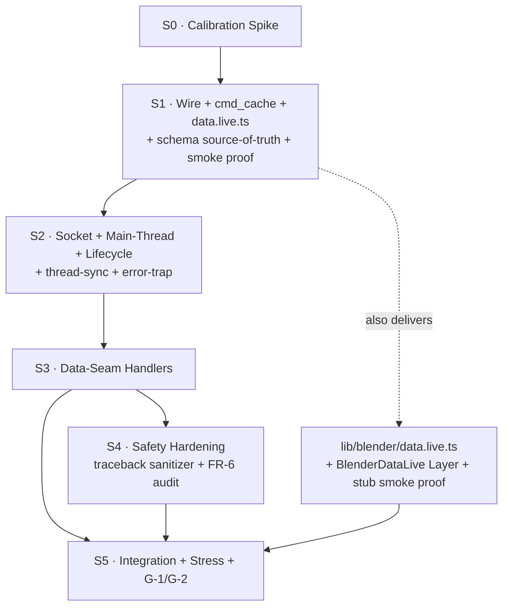

# Sprint Plan · Blender Adapter · Python Addon (v0)

> Cycle: `blender-adapter-2026-05-18`. This sprint plan executes the PRD r1 + SDD r1 phasing pinned in SDD §7. **r2 (2026-05-19) drops FR-12 escape hatch from v0** per operator triage of Flatline blockers (4 of 8 BLOCKERS clustered on FR-12 sandbox-escape class). Six sprints reduce in effort but not count (S0 calibration spike → S5 integration), with S5 closing G-1 + G-2 by running `lib/blender/__tests__/data.test.ts` (the 10/10 contract) against the live addon via a new `BlenderDataLive` Layer.

## Revision Notes (r2 · 2026-05-19)

Integrates Flatline findings from `a2a/flatline/sprint-review.json` (3-voice consensus: codex-headless + claude-headless + gemini-3.1-pro-preview · 80% agreement · 0¢ subscription-CLI). **8 BLOCKERS · 8 HIGH_CONSENSUS · 3 DISPUTED** resolved per operator triage 2026-05-19:

| Finding | Severity | r1 problem | r2 resolution |
|---|---|---|---|
| **SKP-001 (970/920/850 CRIT ×3)** | FR-12 escape hatch sandbox-escape class | MRO traversal (`().__class__.__mro__[-1].__subclasses__()`) defeats AST + restricted-builtins · cooperative timeout can't contain CPU-bound · PID-bound auth file undiscoverable | **FR-12 DROPPED from v0** · S4 collapses LARGE→SMALL · long-tail need revisits in v1 with proper subprocess+seccomp isolation (operator-decided 2026-05-19) |
| **SKP-002 (920 CRIT · S5 G-2)** | `data.test.ts` mock-vs-live fixture mismatch | Test asserts against synthetic `data.mock.ts` data; live `bpy.data.objects` returns Blender startup scene → tests fail on fixture, not code | **New Task 5.0**: `BlenderDataLive` test fixture initializes scene to deterministic state via `beforeAll` hook (uses `blender.data.createObject` calls, does NOT touch `data.test.ts`); G-2 acceptance unchanged but mechanism specified |
| **SKP-002 (780 HIGH · S2)** | TimerDrainer unhandled exception → permadeath | Single exception in drain callback stops processing forever; addon goes silent without crash signal | **Task 2.2 patched**: global `try/except Exception` wrap around entire TimerDrainer body · log error · always return 0.016s retry interval |
| **SKP-003 (780 HIGH · S2)** | ConnHandlerIndex shared-mutable, no lock | Main thread (force_close) + BG accept loop (register/deregister) mutate without synchronization | **Task 2.5 patched**: `threading.Lock` on all `ConnHandlerIndex` mutations + iteration; documented in SDD §3.6 (followup) |
| **SKP-002 (760 HIGH · S1/S5)** | Layer-selection mechanism for `data.test.ts` against `BlenderDataLive` unspecified | "Run unchanged against live" requires DI mechanism that's not pinned in the plan | **New Task 1.10**: S1 proves data.test.ts runs unchanged against a STUB `BlenderDataLive` (no real Blender) · validates DI mechanism before S5 commits to it (closes IMP-004 late-integration risk) |
| **IMP-001 (945 HIGH)** | Python flat-module vs package import ambiguity | Same import path can't resolve as both flat module and package | **Already covered by Task 0.2** (S0 spike validates packaging path) — clarified in S0 deliverables: spike outcome IS the binary decision input for S1 layout |
| **IMP-002 (915 HIGH)** | No single schema source of truth · semantic contracts drift | Cross-language parity tests validate bytes while semantics drift | **New Task 1.9**: pin schemas as artifacts (Effect Schema in TS + Python-side mirror) · ProtocolMismatch · WireCommand · WireResponse · op discriminators all schema-anchored |
| **IMP-005 (820 HIGH)** | GUI vs headless authoritative mode unspecified | Smoke-test.sh headless + manual GUI steps mix → environment-specific failures | **Acceptance criteria patched (S0 + S5)**: GUI mode = authoritative; headless mode = best-effort with documented caveats |
| **IMP-010 (805 HIGH)** | Cache scope under reconnects unspecified | Per-connection vs global cache affects whether clients reuse each other's cached responses | **Task 1.5 acceptance patched**: per-connection cmdId scope (LRU keyed by `(conn_id, cmd_id)`) · global scope rejected as a correctness hazard |
| **IMP-012 (795 HIGH)** | Threat model for escape hatch missing | Escape hatch security stack misread as sandboxing | **Moot** (FR-12 dropped) — but README.md (Task 5.4) gains a "future-v1 escape hatch design notes" appendix capturing the SKP-001 cluster lessons for whoever picks up v1 |
| **IMP-015 (700 DISPUTED)** | "No existing files modified" overclaim | pnpm scripts / vitest config / pytest tooling MAY need updates | **Appendix D patched**: explicit allowed-touch list (vitest config for `BLENDER_LIVE` env-based test inclusion · pnpm script entries for blender-live test mode) — bounded, named, NOT a blanket exception |

### Findings NOT integrated (operator-decide / scope-deferred)

- **IMP-006 (745 HIGH)** AST-scan misses indirect bpy access · **MOOT** — FR-12 dropped removes the surface this was about.
- **IMP-013 (770 DISPUTED)** BLENDER_MCP_ESCAPE_IMPORTS semantic ambiguity · **MOOT** — env var removed with FR-12.
- **IMP-014 (640 DISPUTED · score 0 from opus)** Relative-import packaging defects · S0 calibration spike already validates this surface; additive test coverage deferred to v1.

### Goals affected by FR-12 drop

- **G-3** (`Escape hatch run_python_code returns structured success or error · NEVER crashes`) → **DEFERRED to v1**. The underlying safety property (structured handler errors · never crash addon process) is preserved by FR-6 try/except discipline in S3 + S4 traceback sanitizer. The G-3 acceptance test (`pytest: 4 cases · success · syntax error · bpy.ops error · long-running timeout`) is dropped from this cycle.
- All other goals (G-1, G-2, G-4, G-5) unchanged.

### Effort delta

- r1 estimate: ~5 dev days (½d S0 + ~4d S1–S4 series + ½d S5)
- **r2 estimate: ~3.5–4 dev days** (S4 collapse drops 1–1.5 days; S1 grows ~½ day from new tasks 1.9 + 1.10; S5 grows minor from Task 5.0; net ~−1 day)

## Revision Notes (r3 · 2026-05-19 · post-Flatline-r2)

The defensive re-Flatline of r2 (`a2a/flatline/sprint-review-r2.json` · 3-voice · 70% agreement · CRITICALs dropped 970→910 · HIGH_CONSENSUS halved 8→5 — a **convergence** signal, not an expanding problem) surfaced 8 lower-severity blockers. r3 integrates all 8 per operator decision 2026-05-19 (full patch, then kick S0, NO further re-Flatline — per `feedback_eval-before-lock` anti-rabbit-hole). Two were authoring misses owned in candor:

| Finding | r2 problem | r3 resolution |
|---|---|---|
| **IMP-003 (902) / IMP-001 (850)** | `lib/wire.py` (flat module) and `lib/wire/` (package) **cannot coexist** in Python's import system — `import wire` resolves to one or the other. r1 IMP-001 flagged this; it was wrongly waved off as "S0 validates packaging." It is a STATIC layout bug, not a spike question. | **`lib/wire/` is now a package**: `wire.py` content moves to `lib/wire/framing.py`; package holds `__init__.py` + `framing.py` + `case.py` + `schemas.py`. All `lib/wire.py` references updated to `lib/wire/framing.py`. |
| **IMP-004 (772) / SKP-004 (720)** | Stale `~/.blender-mcp/<session>.auth` reference survived in S2's FR-15 `unregister()` sequence — the auth file was FR-12 bearer-token infrastructure, which r2 dropped. | **S2 FR-15 sequence cleaned**: auth-file delete clause removed. No `~/.blender-mcp/` directory exists in v0 at all. |
| **SKP-001 (760)** | PRD r1 + SDD r1 still describe FR-12; sprint.md was "temporarily source-of-record" for the scope cut. | **PRD r2 + SDD r2 patched 2026-05-19** to drop FR-12 / G-3 / AP-7. Sprint.md is no longer carrying an un-reconciled scope cut. |
| **SKP-003 (760)** | `data.live.ts` "reconnect-on-disconnect" had no circuit breaker / max-retry / backoff — infinite reconnect if Blender is down. | **Task 1.8 patched**: max 5 retries · exponential backoff (100ms→200ms→400ms→… capped 5s) · then fail with structured `BlenderNotReachable` Effect error. |
| **SKP-001 (750)** | Task 1.9 Python mirror assumed `jsonschema` third-party dependency. | **Task 1.9 patched**: Python-side validation uses stdlib only (dataclass `__post_init__` type checks + explicit discriminator validation). No new runtime dependency. |
| **IMP-002 (862) / SKP-002 (730)** | Schema source-of-truth named TS Effect Schema as canonical but Python mirror had no generation/conformance DIRECTION — just "round-trip fixtures." | **Task 1.9 patched**: TS Effect Schema is canonical → `regen-fixtures.sh` exports a JSON Schema artifact (`tools/blender-addon/lib/wire/wire.schema.json`) from it → Python `schemas.py` validates against that artifact in CI. One generation direction, explicit. |
| **IMP-005 (772) / SKP-001 (910)** | Live-Blender integration tests could accidentally run in normal CI; Task 5.E2E was manual-only with no scripted/CI form. | **New deliverable + `test:blender-live` script**: Task 5.E2E gains a scripted wrapper (`smoke-test.sh` + `pnpm test:blender-live`) gated behind `BLENDER_LIVE=1` env. Default CI skips it; it CAN be wired to a self-hosted Blender runner later. Manual GUI run remains the authoritative pass. |
| **SKP-002 (830) / SKP-003 (710)** | Task 1.10 stub was too trivial to catch interface incompatibilities; exact Vitest layer-swap mechanism unspecified. | **Task 1.10 patched**: first step MUST name the concrete mechanism (Effect `Layer.provide` substitution — pinned, not "DI somehow"); stub MUST exercise length-prefix framing decode + cmdId request/response correlation, not just return hardcoded fixtures. |

### r3 effort delta

- Net change vs r2: negligible. The wire-package refactor is a file-layout decision (zero LOC delta); the spec patches add precision, not work. **r3 estimate stays ~3.5–4 dev days.**

### r3 close-out posture

Per operator decision: r3 is the final pre-implementation revision. No re-Flatline of r3 — the convergence signal (severity dropping, agreement dropping, no new architectural class) says land. S0 calibration spike is the next empirical check; it surfaces real-Blender ground truth that no amount of document review can.

## Executive Summary

**MVP scope**: a Python Blender addon at `tools/blender-addon/` that bridges agent-driven typed commands (via the existing TypeScript adapter at `lib/blender/`) to real `bpy` operations inside a running Blender 4.x. The addon ships with the same anti-bug discipline already enforced by the TypeScript substrate.

**Total sprints**: 6 (S0–S5) · **effort estimate (r2)**: ~3.5–4 dev days (½d S0 + ~3d S1–S4 in series + ½d S5).

**Sprint shape (r2 · post-Flatline)**:

| Sprint | Scope | Theme | Effort |
|---|---|---|---|
| S0 | SMALL | Calibration spike (Blender 4.5 LTS reality check) | ½ day |
| S1 | LARGE | Wire + cmd_cache + TS `data.live.ts` + schema source-of-truth + S1 smoke proof | 1.5–2 days |
| S2 | MEDIUM | Socket + main-thread plumbing + addon lifecycle (with thread-sync + error-trap patches) | 1 day |
| S3 | MEDIUM | 5 CRUD data-seam handlers | ½ day |
| S4 | SMALL | Safety hardening (traceback sanitizer + handler error-wrap audit) | ½ day |
| S5 | SMALL | Integration + stress + G-1/G-2 closure (with scene-fixture init) | ½ day |

**Key planning decisions (r2)**:

1. **S0 is non-negotiable**: per `feedback_eval-before-lock`, the spike must surface IMP-011 (multi-file addon packaging — also closes IMP-001 945 HIGH), FR-5 r1 (0.016s timer feasibility), and Q-SDD-1 (`bpy.context.temp_override` reachability) BEFORE S1 commits to layout decisions.
2. **S1 carries the TS-side `data.live.ts` workload + schema source-of-truth + smoke-proof** (PRD-flatline IMP-001 + sprint-flatline IMP-002 + IMP-004 + SKP-002 760). G-1 + G-2 are unverifiable without `data.live.ts`; layer-swap mechanism is unverifiable without the smoke proof; cross-language parity is unverifiable without a shared schema artifact.
3. **S2's lifecycle invariants (FR-15) + thread-sync + error-trap are load-bearing**: reload-port-release tests gate the rest of the sprint sequence. Plus (r2): TimerDrainer global try/except (SKP-002 780) + ConnHandlerIndex threading.Lock (SKP-003 780). Without these, S5 stress test reveals these classes as genuine deadlocks or silent permadeaths.
4. **FR-12 escape hatch DROPPED from v0** (r2): the SKP-001 sandbox-escape class (MRO traversal, cooperative-timeout limitation, PID-bound auth file) was deemed beyond v0 scope per operator triage 2026-05-19. Revisits in v1 with subprocess + seccomp/AppArmor isolation. S4 collapses to safety hardening (traceback sanitizer + FR-6 try/except discipline audit). G-3 deferred to v1.
5. **S5 success criterion is concrete and named today, with scene fixture mechanism specified (r2)**: `lib/blender/__tests__/data.test.ts` runs unchanged against the live addon via a new `BlenderDataLive` Effect Layer · `beforeAll` hook in a NEW test-setup file (NOT `data.test.ts` itself) initializes Blender scene to deterministic state via `blender.data.createObject` calls. 10/10 pass = G-1 + G-2 closed.

**Goal traceability (r2)**: see Appendix C. 4 of 5 PRD goals (G-1, G-2, G-4, G-5) mapped to tasks across S0–S5; **G-3 deferred to v1** with the FR-12 escape hatch (operator-recorded scope decision). E2E validation task is **Task 5.E2E** (the 10/10 contract run), de-risked by the S1 smoke proof (Task 1.10).

---

## Sprint 0 · Calibration Spike (½ day)

**Scope**: SMALL (3 tasks)

### Sprint Goal

Validate threading model viability, addon-packaging path, and 60FPS timer feasibility in real Blender 4.5 LTS before S1 commits to design.

> From SDD §7: *"Discover threading API gotchas BEFORE S1 commits to design (per `feedback_eval-before-lock-and-breadth-depth-tension`)"*

### Deliverables

- [ ] `tools/blender-addon/spike.py` (~120 LOC single-file) listening on TCP · accepts one length-prefixed frame · echoes it
- [ ] Spike validates that a multi-file addon-package (`lib/__init__.py`-style) loads in Blender 4.5 LTS [resolves IMP-011 DISPUTED]
- [ ] Spike measures `bpy.app.timers.register(fn, persistent=True)` overhead at 0.016s interval [validates FR-5 r1 60FPS]
- [ ] Spike confirms `bpy.context.temp_override` reachable from timer callback [validates SDD-flatline SKP-002 HIGH 750 + resolves Q-SDD-1]
- [ ] `sprint-0-COMPLETED.md` lessons-learned doc per `feedback_eval-before-lock` (calibration outputs land here so S1+ inherit)
- [ ] Spike file deletes itself after S0 completion (FR-0 contract · NET 0 LOC to cycle)

### Acceptance Criteria

- [ ] Spike runs in real Blender 4.5 LTS · receives 1 length-prefixed frame · echoes it · NO "Incomplete JSON" failures
- [ ] Multi-file package loads OR S1 task list updates to single-file fallback layout (binary outcome)
- [ ] 0.016s timer overhead measurement recorded (pass = drain finishes within 16ms with ≤20 items; fail = surface to operator pair-point for FR-5 revision)
- [ ] `bpy.context.temp_override` callable from inside `bpy.app.timers` callback validated (pass/fail recorded)
- [ ] `sprint-0-COMPLETED.md` written with: packaging-path verdict · timer overhead p50/p99 · context_override verdict · any threading gotchas observed

### Technical Tasks

- [ ] **Task 0.1**: Write `tools/blender-addon/spike.py` — single-file 120 LOC addon · bl_info · register/unregister · TCP listener on `127.0.0.1:9876` · accept one length-prefixed frame · echo it back framed · log timer-drain p50/p99 to Blender text console → **[G-1]** **[G-4 / AP-1, AP-6]**
- [ ] **Task 0.2**: Manual operator-paced validation in Blender 4.5 LTS — install spike addon · run `lib/blender/wire.ts` encoder from a small node script · send 1 frame · capture echo · measure latency · attempt `bpy.context.temp_override` from inside the timer callback · attempt to load a stub `lib/__init__.py`-package as a second addon · record all outcomes to `sprint-0-COMPLETED.md` → **[G-1]**
- [ ] **Task 0.3**: Author `sprint-0-COMPLETED.md` lessons distillation (packaging verdict · timer feasibility verdict · context_override verdict · any threading gotchas) · delete `spike.py` after audit (FR-0 contract) → **[G-4]**

### Dependencies

- Blender 4.5 LTS installed on operator machine (per PRD §5.1, already true)
- `lib/blender/wire.ts` TS encoder (landed 2026-05-18, available)

### Risks & Mitigation

| Risk | Likelihood | Impact | Mitigation |
|---|---|---|---|
| Multi-file addon packaging unsupported in Blender 4.5 LTS | Low | High | If hit: S1 task list updates to single-file `addon.py` fallback layout (PRD §5.3 §6.3 explicitly accepts this fallback); operator pair-point at S0 close decides |
| 0.016s timer overhead exceeds 16ms drain budget | Low | Medium | Operator pair-point — revise FR-5 interval upward to 0.033s (30FPS-equivalent) or accept p50 ≤ 75ms SLA degradation |
| `bpy.context.temp_override` not reachable from timer callback | Medium | Medium | Document workaround in SDD §3.1 update (window/area/screen attribute population from timer); v1 may revisit |

### Success Metrics

- 1/1 length-prefixed echo round-trip succeeds in real Blender
- Timer drain p50 ≤ 16ms / p99 ≤ 50ms at 0.016s interval (or operator-decided revision recorded)
- `sprint-0-COMPLETED.md` exists and references all three calibration outcomes

---

## Sprint 1 · Wire + cmd_cache + TS `data.live.ts` (1.5–2 days · r2)

**Scope**: LARGE (10 tasks · r2 added 1.9 schema-source-of-truth + 1.10 S1 smoke proof)

### Sprint Goal

Land the Python wire protocol, idempotency cache, cross-language schema-drift gate, AND the TypeScript-side socket client that mirrors the protocol — so G-1 + G-2 become verifiable at S5 close.

> From SDD §7: *"S1 also ships `lib/blender/data.live.ts` (TS-side · was R-4) + parity fixtures + CI wire-parity workflow"*

### Deliverables

- [ ] `tools/blender-addon/lib/wire/framing.py` — `FrameReader` + `FrameWriter` + `WireCommand` / `WireResponse` dataclasses · 4-byte BE uint32 length-prefix framing *(r3: `lib/wire/` is a package — `wire.py` flat module would collide with the `wire/` directory)*
- [ ] `tools/blender-addon/lib/cmd_cache.py` — `CmdIdCache` LRU (collections.OrderedDict-backed · default 256 entries · FR-3)
- [ ] `tools/blender-addon/lib/config.py` — single source of constants (port · host · queue-size · LRU-size · MAX_FRAME_BYTES · env-var overrides)
- [ ] `tools/blender-addon/lib/wire/case.py` — snake_case ↔ camelCase converter per SDD §4.3 normative field-mapping table
- [ ] `tools/blender-addon/tests/test_wire.py` — round-trip + chunk-boundary cases + MAX_FRAME_BYTES rejection + FrameError emission
- [ ] `tools/blender-addon/tests/test_cmd_cache.py` — LRU eviction + dedup behavior (FR-3)
- [ ] `tools/blender-addon/tests/fixtures/ts-roundtrip-cases.json` — cross-language parity fixture (generated from TS encoder via `regen-fixtures.sh`)
- [ ] `tools/blender-addon/scripts/regen-fixtures.sh` — invoked from CI on changes to `lib/blender/wire.ts`
- [ ] `lib/blender/data.live.ts` — TS-side socket client mirroring Python wire (reconnect-on-disconnect · `BlenderDataLive` Effect Layer) *(r2: bearer-token handshake removed — FR-12 dropped)*
- [ ] `lib/blender/__tests__/data.live.test.ts` — TS-side unit tests for socket client (use mocked socket; full live test ships in S5)
- [ ] `tools/blender-addon/pyproject.toml` + `requirements-dev.txt` (pytest · pytest-cov · ruff · fake-bpy-module-latest)
- [ ] `.github/workflows/blender-wire-parity.yml` — CI step running `pnpm test --filter blender-wire-parity` on every commit
- [ ] **r2: schema source-of-truth** · `lib/blender/wire.schema.ts` (Effect Schema definitions for `WireCommand` · `WireResponse` · op discriminators · `ProtocolMismatch`) + Python mirror at `tools/blender-addon/lib/wire/schemas.py` (dataclasses + runtime validators) · cross-referenced via the same JSON-canonical encoding [IMP-002 915]
- [ ] **r2: S1 smoke proof** · `lib/blender/__tests__/data.live.stub.test.ts` runs `data.test.ts` UNCHANGED against a stub `BlenderDataLive` Layer (no real Blender) to prove the layer-swap mechanism works · validates DI surface before S5 commits [IMP-004 875 + SKP-002 760]

### Acceptance Criteria

- [ ] `tests/test_wire.py` passes: 1MB payload round-trip succeeds (AP-1) · malformed JSON returns `kind="BadParams"` (AP-4) · header > MAX_FRAME_BYTES closes connection (FR-17) · 30s incomplete-frame deadline fires (FR-17)
- [ ] `tests/test_cmd_cache.py` passes: 256-entry LRU evicts oldest · same cmdId returns cached response (no re-execution)
- [ ] Cross-language parity fixture round-trips: TS encoder → Python decoder → re-encoder → byte-identical (FR-14)
- [ ] CI wire-parity workflow fails the build on mismatch (proven by deliberately-broken fixture commit + revert)
- [ ] `protocol_version: "1.0"` present in every frame; mismatched versions return `WireResponseError(kind="ProtocolMismatch")`
- [ ] `lib/blender/data.live.ts` exists with: `BlenderDataLive` Effect Layer · socket connect / disconnect / reconnect · length-prefix framing on TS side · TS unit tests passing against mocked socket
- [ ] **r2 · IMP-002**: `wire.schema.ts` + `schemas.py` define the same wire vocabulary · round-trip parity fixture validates TS-encode/Python-decode/Python-validate/re-encode is byte-identical
- [ ] **r2 · IMP-010**: cmdId cache scope is **per-connection** (LRU keyed by `(conn_id, cmd_id)`) · cross-connection cache leakage explicitly rejected in `test_cmd_cache.py`
- [ ] **r2 · IMP-004 + SKP-002 760**: `data.test.ts` runs UNCHANGED against stub `BlenderDataLive` · 10/10 pass (this is the layer-swap mechanism proof; S5 just substitutes stub→real)
- [ ] Coverage ≥ 85% on `lib/wire/framing.py` + `lib/cmd_cache.py` + `lib/config.py` + `lib/wire/case.py` + `lib/wire/schemas.py`

### Technical Tasks

- [ ] **Task 1.1**: Scaffold `tools/blender-addon/` directory structure per SDD §2.1 · create `pyproject.toml` + `requirements-dev.txt` · run `pip install -r requirements-dev.txt` to verify fake-bpy-module-latest installs cleanly → **[G-4]**
- [ ] **Task 1.2**: Implement `lib/config.py` — port/host/queue-size/lru-size/MAX_FRAME_BYTES constants · `BLENDER_MCP_*` env-var overrides per PRD §5.1–5.2 → **[G-1]**
- [ ] **Task 1.3**: Implement `lib/wire/framing.py` per SDD §2.2 — `FrameReader.read_frame()` with MAX_FRAME_BYTES enforcement + 30s incomplete-frame deadline · `FrameWriter.write_frame()` with length-prefix · `WireCommand` / `WireResponse` dataclasses · new `kind="FrameError"` + `kind="ProtocolMismatch"` error types · **r3**: created inside the `lib/wire/` package (NOT a flat `lib/wire.py` — would collide with the package dir) → **[G-1]** **[G-4 / AP-1, AP-4]**
- [ ] **Task 1.4**: Implement `lib/wire/case.py` snake_case ↔ camelCase converter per SDD §4.3 NORMATIVE field-mapping table → **[G-1]**
- [ ] **Task 1.5**: Implement `lib/cmd_cache.py` — `CmdIdCache` LRU using `collections.OrderedDict` · `move_to_end` on hit · `popitem(last=False)` on eviction · default 256 entries (FR-3 + Q-SDD-3) → **[G-1]**
- [ ] **Task 1.6**: Write `tests/test_wire.py` + `tests/test_cmd_cache.py` per SDD §6.1 — chunk-boundary cases · MAX_FRAME_BYTES rejection · LRU eviction shape · dedup behavior → **[G-1]** **[G-4 / AP-1, AP-4]**
- [ ] **Task 1.7**: Author `scripts/regen-fixtures.sh` + `tests/fixtures/ts-roundtrip-cases.json` · CI workflow `.github/workflows/blender-wire-parity.yml` that runs TS encoder → Python decoder → re-encoder · byte-identical assertion (FR-14 + R-SDD-2 mitigation) → **[G-1]** **[G-4 / AP-1]**
- [ ] **Task 1.8**: Implement `lib/blender/data.live.ts` per SDD §2.3 — `BlenderDataLive` Effect Layer · socket client with length-prefix framing · TS unit tests in `lib/blender/__tests__/data.live.test.ts` against mocked socket · **r3 · SKP-003 760 reconnect policy**: bounded reconnect — max 5 retries · exponential backoff (100ms → 200ms → 400ms → 800ms → capped 5s) · on exhaustion fail with structured `BlenderNotReachable` Effect error (NOT infinite reconnect) · unit test asserts the retry ceiling fires → **[G-1]** **[G-2]** *(r2: bearer-token handshake removed — FR-12 dropped from v0)*
- [ ] **Task 1.9 (r2 · IMP-002 · r3-refined)**: Author `lib/blender/wire.schema.ts` (Effect Schema for `WireCommand` · `WireResponse` · op-name discriminators · `ProtocolMismatch` · `BadParams` · `FrameError`) — **this is the canonical source of truth**. **r3 generation direction (IMP-002 862 / SKP-002 730)**: `scripts/regen-fixtures.sh` exports a JSON Schema artifact `tools/blender-addon/lib/wire/wire.schema.json` FROM the TS Effect Schema · Python mirror `lib/wire/schemas.py` is dataclasses validated against `wire.schema.json` using **stdlib only** (dataclass `__post_init__` type checks + explicit discriminator validation — **r3 · SKP-001 750: NO `jsonschema` third-party dependency**) · CI conformance step asserts `schemas.py` accepts/rejects the same inputs as `wire.schema.json` · parity fixture (`tests/fixtures/ts-roundtrip-cases.json`) regenerated from the TS schema → **[G-1]** **[G-4]**
- [ ] **Task 1.10 (r2 · IMP-004 + SKP-002 760 · r3-refined)**: Write `lib/blender/__tests__/data.live.stub.test.ts` — runs the existing `data.test.ts` UNCHANGED against a stub `BlenderDataLive` Effect Layer (no real Blender). **r3 · SKP-003 710 — name the mechanism**: the layer-swap is Effect `Layer.provide` substitution (the stub Layer satisfies the same `BlenderData` service tag as `BlenderDataLive`) — pinned here, not "DI somehow". **r3 · SKP-002 830 — stub rigor**: the stub MUST NOT just return hardcoded fixtures — it MUST exercise (a) the length-prefix framing decode path on the response bytes, (b) cmdId request/response correlation (response cmdId matches request cmdId), (c) one structured-error round-trip (`kind="BlenderError"`). This proves the layer-swap mechanism AND the wire interface, de-risking S5's terminal G-2 closure → **[G-1]** **[G-2]**

### Dependencies

- S0 calibration outcomes recorded in `sprint-0-COMPLETED.md` (packaging verdict informs Task 1.1 layout)
- `lib/blender/wire.ts` (TS encoder · landed)
- TypeScript test infrastructure (vitest · already in project)

### Risks & Mitigation

| Risk | Likelihood | Impact | Mitigation |
|---|---|---|---|
| Cross-language fixture goes stale (R-SDD-2) | Medium | Medium | `regen-fixtures.sh` invoked from CI · pre-commit hook (informational) warns if `lib/blender/wire.ts` is newer than fixture |
| MAX_FRAME_BYTES default (10MB) too tight for legitimate large-mesh payloads | Low | Medium | Tunable via `BLENDER_MCP_MAX_FRAME_BYTES` env; raise at S5 if stress test hits ceiling |
| TS `data.live.ts` unit tests need real socket semantics not easily mockable | Medium | Low | Use Node's `net` module mocking (vitest mock-fs pattern); full integration coverage lands in S5 anyway |
| OrderedDict.move_to_end re-entrancy (R-SDD-4) | Very Low | Low | Handlers don't call back into cache · revisit at v1 |

### Success Metrics

- Coverage ≥ 85% on Sprint 1 modules (`pytest --cov=tools/blender-addon/lib`)
- 0 wire-parity CI failures across the sprint
- TS `data.live.ts` connects + disconnects + reconnects against a stub Python server (proven in Task 1.8 unit tests)
- 1MB payload round-trip succeeds locally (AP-1 negative test passes)

---

## Sprint 2 · Socket + Main-Thread Plumbing + Addon Lifecycle (1 day)

**Scope**: MEDIUM (6 tasks)

### Sprint Goal

Wire the BG socket thread + main-thread timer drainer + addon `register()`/`unregister()` lifecycle (FR-15) into a working `addon.py` that accepts connections, drains commands, and releases port 9876 cleanly on reload.

> From SDD §7: *"AcceptLoop accepts a connection but no ops registered yet (all return UnknownOp)"*

### Deliverables

- [ ] `tools/blender-addon/lib/socket_server.py` — `AcceptLoop` + `ConnHandler` (BG thread · per-connection `out_queue` · `SO_RCVTIMEO` · explicit accept-and-close-with-ServerBusy)
- [ ] `tools/blender-addon/lib/main_thread.py` — `TimerDrainer` (60FPS · `bpy.app.timers.register(drain, persistent=True)` · `put_nowait` discipline · global try/except wrap per r2 SKP-002 780)
- [ ] `tools/blender-addon/addon.py` — bl_info + full FR-15 register/unregister sequence + optional UI panel
- [ ] `ConnHandlerIndex` — per-connection registry with `conn_id → ConnHandler` mapping for force_close signaling
- [ ] `tools/blender-addon/lib/ops/registry.py` — `OP_HANDLERS` dict + `register` decorator (empty handler set at S2; populated in S3/S4)
- [ ] `tools/blender-addon/tests/test_socket_server.py` — framing + LRU dedup at socket level + lifecycle reload-port-release test (§3.7 r1)

### Acceptance Criteria

- [ ] BG socket thread accepts connections on `127.0.0.1:9876` (or `BLENDER_MCP_PORT` override) · NEVER touches `bpy.*` (AP-2 passes via AST scan)
- [ ] Main thread drainer runs at 0.016s · processes ≤ `MAX_DRAIN_PER_TICK` (20) items per tick · returns within drain budget
- [ ] `unregister()` executes the full FR-15 sequence: stop_event set · timer unregistered · BG thread join with 2s timeout · listening socket closed · cmdId LRU + per-conn queues dropped *(r3: `~/.blender-mcp/<session>.auth` delete removed — that file was FR-12 bearer-token infra, dropped in r2; no `~/.blender-mcp/` dir exists in v0)*
- [ ] Reload-port-release test: register addon · unregister addon · re-register addon · port 9876 binds without "address in use" error (§3.7 r1 invariant)
- [ ] Back-pressure (FR-16): BG `inbox.put_nowait` on Full emits `WireResponseError(kind="Backpressure")` · Main `out_queue.put_nowait` on Full sets `force_close` event · BG observes flag, closes connection
- [ ] AP-5 passes: no `anyio` import anywhere in `tools/blender-addon/`
- [ ] AP-6 passes: no `ProactorEventLoop` reference; addon uses stdlib `socket` + `threading`
- [ ] **r2 · SKP-002 780**: TimerDrainer top-level `try/except Exception` proven by `test_timer_drainer_survives_handler_exception.py` (inject a handler that raises · assert drainer keeps firing on subsequent ticks · assert error is logged to stderr)
- [ ] **r2 · SKP-003 780**: `ConnHandlerIndex` no-corruption under concurrent register/deregister proven by `test_conn_handler_index_concurrent.py` (50+50 calls across 2 threads · final state matches expected · no `KeyError` raised mid-iteration during force_close broadcast)
- [ ] Manual: install addon · connect from `data.live.ts` · receive `WireResponseError(kind="UnknownOp")` for any op (S3 adds handlers)

### Technical Tasks

- [ ] **Task 2.1**: Implement `lib/socket_server.py` per SDD §2.2 — `AcceptLoop.run()` with `select()` + `SO_RCVTIMEO` 30s + `stop_event` check · `ConnHandler.run()` with private `out_queue: queue.Queue(maxsize=512)` + per-conn `force_close: threading.Event` · half-open detection per §3.2 r1 · NEVER touches `bpy.*` → **[G-1]** **[G-4 / AP-2, AP-5, AP-6]**
- [ ] **Task 2.2**: Implement `lib/main_thread.py` `TimerDrainer` — registers via `bpy.app.timers.register(drain, persistent=True)` at 0.016s · drains ≤ `MAX_DRAIN_PER_TICK` items per tick · routes via `OP_HANDLERS` registry · `out_queue.put_nowait` discipline (FR-16) · UnknownOp path · **r2 · SKP-002 780**: top-level `try/except Exception` wrapping the ENTIRE drain callback body · on exception: log error via `bpy.app.driver_namespace` warn channel + `print(traceback.format_exc(), file=sys.stderr)` + ALWAYS return the 0.016s retry interval so the timer keeps firing → **[G-1]**
- [ ] **Task 2.3**: Implement `lib/ops/registry.py` — `OP_HANDLERS: dict[str, Callable]` + `@register("op.name")` decorator · empty handler set at S2 close (S3 + S4 populate) → **[G-1]**
- [ ] **Task 2.4**: Implement `addon.py` — bl_info dict (Blender 4.x) · `register()` starts socket thread + registers timer · `unregister()` executes full FR-15 sequence with 2s per-step hard timeout · minimal UI panel showing connection status → **[G-1]** **[G-4 / AP-3]**
- [ ] **Task 2.5**: Implement `ConnHandlerIndex` — module-private registry mapping `conn_id → ConnHandler` for main-thread force_close signaling per SDD §3.6 · **r2 · SKP-003 780**: protect ALL mutations (`register`, `deregister`) and iterations (force_close broadcasting) with a `threading.Lock` held for the duration of each critical section · pin lock-ownership protocol in module docstring · add `test_conn_handler_index_concurrent.py` exercising 50 register + 50 deregister calls across 2 threads with assertion-free no-corruption invariant → **[G-1]**
- [ ] **Task 2.6**: Write `tests/test_socket_server.py` — framing through real loopback socket · LRU dedup at socket level · **FR-15 reload-port-release test** · FR-16 back-pressure test · `tests/test_antipatterns.py` (partial: AP-2, AP-5, AP-6) → **[G-4 / AP-2, AP-5, AP-6]**

### Dependencies

- S1: `lib/wire/framing.py`, `lib/cmd_cache.py`, `lib/config.py` (must exist)
- `lib/blender/data.live.ts` (S1) for manual connect-and-UnknownOp validation

### Risks & Mitigation

| Risk | Likelihood | Impact | Mitigation |
|---|---|---|---|
| BG thread doesn't join cleanly within 2s on `unregister()` | Medium | Medium | Daemon-thread fallback (log warning, accept process-exit cleanup) per FR-15 step 3 |
| Port 9876 doesn't release on reload | Low | High | `SO_REUSEADDR` + explicit `socket.close()` in FR-15 step 4 · reload-port-release test gates the sprint |
| Connection lifecycle interleaves badly across multiple sequential TS clients | Medium | Medium | Per-connection `out_queue` + `conn_id` correlation per Q-SDD-2/Q-SDD-6 · §3.2 r1 deterministic accept-and-close-with-ServerBusy when busy |
| `bpy.app.timers` callback overruns at 60FPS under main-thread CPU pressure (R-SDD-3) | Medium | Medium | Document in README · `MAX_DRAIN_PER_TICK=20` caps work per tick · revisit p99 budget in v1 |

### Success Metrics

- `pytest tests/test_socket_server.py` passes including reload-port-release test
- Manual `data.live.ts` ↔ addon connect succeeds; UnknownOp returned for any op
- AP-2, AP-5, AP-6 regression tests pass
- Operator pair-point at S2 close: continue with the minimal-build OR pivot to sandraschi fork (R-5)

---

## Sprint 3 · Data-Seam Handlers (½ day)

**Scope**: MEDIUM (5 tasks)

### Sprint Goal

Land 5 CRUD data-seam handlers (FR-7..FR-11) using lazy `bpy` imports (AP-8) so the `fake_bpy` pytest fixture keeps unit tests Blender-free, and the existing 10/10 TS contract becomes runnable against the live addon.

> From SDD §7: *"all handlers lazy-import bpy (AP-8 enforces)"*

### Deliverables

- [ ] `tools/blender-addon/lib/ops/data_handlers.py` — 5 handlers (`list_objects` · `get_object` · `create_object` · `update_object` · `delete_object`) registered via `@register` decorator
- [ ] `tools/blender-addon/tests/conftest.py` — `fake_bpy` fixture (uses `fake-bpy-module-latest` PyPI stub) + `tmp_port` fixture
- [ ] `tools/blender-addon/tests/test_data_ops.py` — full handler coverage against `fake_bpy` fixture · validates SDD §4.3 normative field mapping
- [ ] AP-8 enforcement test in `tests/test_antipatterns.py` — AST scan of `lib/ops/data_handlers.py` rejects top-level `import bpy`

### Acceptance Criteria

- [ ] FR-7 `blender.data.listObjects`: returns `BlenderObject[]` projection (name · type · location · rotation · scale · meshName · materialNames · visible · parentName) per `lib/blender/data.port.ts:53-67`
- [ ] FR-8 `blender.data.getObject`: returns `BlenderObject` or `WireResponseError(kind="BlenderError", _tag="ObjectNotFound")`
- [ ] FR-9 `blender.data.createObject`: creates via `bpy.data.objects.new()` · applies defaults · returns created object · `ObjectAlreadyExists` if name taken
- [ ] FR-10 `blender.data.updateObject`: applies patch · returns updated object · `ObjectNotFound` / `InvalidPatch` failures
- [ ] FR-11 `blender.data.deleteObject`: deletes via `bpy.data.objects.remove(obj, do_unlink=True)` · idempotent at cmdId level · `ObjectNotFound` failure
- [ ] AP-8 passes: AST scan of all files under `lib/ops/` rejects top-level `import bpy` / `from bpy import …` — handlers MUST lazy-import inside function bodies
- [ ] AP-3 passes: AST scan rejects any `bpy.types.X = ...` assignments in addon code
- [ ] Coverage ≥ 85% on `lib/ops/data_handlers.py`
- [ ] Field projections validated against SDD §4.3 NORMATIVE field-mapping table (Python snake_case ↔ TS camelCase verified)

### Technical Tasks

- [ ] **Task 3.1**: Implement `lib/ops/data_handlers.py` `list_objects` + `get_object` handlers · lazy `import bpy` inside each function body · projection per SDD §4.3 → **[G-2]** **[G-4 / AP-8]**
- [ ] **Task 3.2**: Implement `lib/ops/data_handlers.py` `create_object` + `update_object` + `delete_object` handlers · `try/except Exception` wrap per FR-6 · traceback sanitization stub (full sanitizer lands in S4) → **[G-2]** **[G-4 / FR-6]**
- [ ] **Task 3.3**: Write `tests/conftest.py` — `fake_bpy` fixture using `fake-bpy-module-latest` per Q-SDD-5 resolution · `tmp_port` fixture for socket tests → **[G-2]** **[G-4 / AP-8]**
- [ ] **Task 3.4**: Write `tests/test_data_ops.py` — full handler coverage · ObjectNotFound / ObjectAlreadyExists / InvalidPatch paths · field-mapping table verification → **[G-2]** **[G-4]**
- [ ] **Task 3.5**: Implement AP-8 + AP-3 regression tests in `tests/test_antipatterns.py` — AST-walk all files under `lib/ops/`; fail on module-level `import bpy` / `bpy.types.X = ...` assignments → **[G-4 / AP-3, AP-8]**

### Dependencies

- S2: `lib/ops/registry.py` (for `@register` decorator)
- S1: `lib/wire/framing.py` `WireResponse` types
- `fake-bpy-module-latest` (PyPI) installed via `requirements-dev.txt`

### Risks & Mitigation

| Risk | Likelihood | Impact | Mitigation |
|---|---|---|---|
| `fake-bpy-module-latest` drifts from Blender 4.5 LTS API (R-SDD-1) | Low | Low | Pin exact version in `requirements-dev.txt` · bump deliberately at v1 |
| Field projection misses an edge-case (e.g., empty parents, hidden meshes) | Medium | Low | SDD §4.3 normative table is the source of truth; any drift = bug filed at S5 |
| Object creation API differs subtly across Blender 4.x minor versions (R-1) | Low | Medium | Test against 4.5 LTS as primary · document 4.6 + 5.0 as "untested but should work" |

### Success Metrics

- 5/5 handlers pass pytest with `fake_bpy` fixture
- AP-3 + AP-8 regression tests pass
- Coverage ≥ 85% on `lib/ops/data_handlers.py`
- Manual: live addon (S2) + handlers (S3) responds correctly to `BlenderDataLive.listObjects()` from TS side

---

## Sprint 4 · Safety Hardening (½ day · r2)

**Scope**: SMALL (2 tasks · r2 collapsed from LARGE 8 tasks after FR-12 escape hatch dropped from v0)

### Sprint Goal

Ship handler-level safety: traceback sanitization (so handler errors don't leak `$HOME`/`$CWD`/`$USER`/`$BLENDER` paths in `kind="BlenderError"` responses) + audit that all `bpy.ops.*` / `bpy.data.*` calls in S3 handlers are `try/except`-wrapped (FR-6 discipline). **No escape hatch in v0** — the SKP-001 sandbox-escape class (MRO traversal · cooperative-timeout limitation · PID-bound auth file) means a credible sandbox needs subprocess + seccomp/AppArmor isolation, which is beyond v0 scope. Revisit in v1.

> Per operator triage 2026-05-19: "feature that looks secure but is not" is the most dangerous outcome (SKP-001 970 CRIT). Dropping FR-12 from v0 is the honest move.

### Deliverables

- [ ] `tools/blender-addon/lib/safety/traceback_sanitizer.py` — strips `$HOME`, `$CWD`, `$USER`, `$BLENDER` paths from traceback strings (§3.4 · FR-6 dependency)
- [ ] `tools/blender-addon/tests/test_traceback_sanitizer.py` — sanitizer surface audit covering 4 path categories
- [ ] **FR-6 audit task**: AST-walk all S3 handlers (`lib/ops/data_handlers.py`) · assert every `bpy.ops.*` / `bpy.data.*` call site is inside a `try/except` block · assert all caught exceptions route through traceback_sanitizer before constructing `WireResponseError(kind="BlenderError")` · this is a static check, not a runtime test
- [ ] `tools/blender-addon/tests/test_handler_error_wrap.py` — runtime proof that injecting a `bpy.data.objects.remove` failure produces a sanitized `kind="BlenderError"` response (NOT a crash · NOT a leak)

### Acceptance Criteria

- [ ] Sanitizer audit: all 4 path categories (`$HOME` · `$CWD` · `$USER` · `$BLENDER`) replaced in test traceback strings · §3.4 regex surface validated
- [ ] FR-6 audit passes: all S3 handlers' `bpy.*` access is inside `try/except` · all caught exceptions are sanitized before being returned to wire
- [ ] Runtime injection test: simulate a `bpy.data.objects.remove` failure (via monkeypatch in `test_handler_error_wrap.py`) · assert response is `WireResponseError(kind="BlenderError", message=<sanitized>, _tag=<error class>)` · assert no traceback leakage of `$HOME` or `$USER`
- [ ] Coverage ≥ 85% on `lib/safety/traceback_sanitizer.py`
- [ ] README documents the FR-12 deferral honestly: "v0 ships without the run_python_code escape hatch · long-tail need revisits in v1 with proper subprocess + OS-level isolation · do NOT enable cooperative-timeout-only sandbox patterns in production"

### Technical Tasks

- [ ] **Task 4.1**: Implement `lib/safety/traceback_sanitizer.py` — `_build_replacements()` regex-based path stripping for `$HOME` / `$CWD` / `$USER` / `$BLENDER` per SDD §3.4 · `sanitize_traceback(tb_str: str) -> str` API · `sanitize_exception(exc: Exception) -> dict` API constructing `{message, _tag, traceback_sanitized}` for use in `WireResponseError(kind="BlenderError")` → **[G-4]**
- [ ] **Task 4.2**: Audit S3 handlers + write `tests/test_handler_error_wrap.py` — AST-walk `lib/ops/data_handlers.py` · assert FR-6 try/except discipline · write monkeypatch-based runtime test injecting a bpy failure · plus `tests/test_traceback_sanitizer.py` (4 path categories · multi-line traceback strings) · plus update `tools/blender-addon/README.md` with the FR-12-deferred honesty note → **[G-4]**

### Dependencies

- S3: `lib/ops/data_handlers.py` (Task 4.2 audits it · must exist)

### Risks & Mitigation

| Risk | Likelihood | Impact | Mitigation |
|---|---|---|---|
| Sanitizer misses a new path category (e.g., workspace symlink) (R-SDD-5) | Medium | Low | Regex is extensible · audit at v1 · §3.4 documents extension path |
| S3 handler skips try/except for a "trivial" bpy call | Medium | Low | Task 4.2 AST audit catches this · CI gate fails the build |
| Operator misreads "FR-12 deferred" as "we'll add it next sprint" | Low | Medium | README explicitly documents the v1 design path requires subprocess isolation, not cooperative-timeout patterns · linked back to SKP-001 cluster lessons in cycle-COMPLETED.md |

### Success Metrics

- Sanitizer test covers all 4 path categories + multi-line tracebacks
- FR-6 audit test passes (static + runtime)
- Coverage ≥ 85% on `lib/safety/traceback_sanitizer.py`
- README documents FR-12 deferral honestly (operator-readable)

---

## Sprint 5 · Integration + Stress + G-1/G-2 Closure (½ day · r2)

**Scope**: SMALL (5 tasks · r2 added 5.0 scene-fixture init)

### Sprint Goal

Close G-1 + G-2 by running `lib/blender/__tests__/data.test.ts` (the existing 10/10 contract · NO test changes) against the live addon via the `BlenderDataLive` Effect Layer. Validate G-5 via 1000-cmd stress test. Ship the `smoke-test.sh` mitigation for R-2.

> From SDD §7: *"G-1 G-2 closure: the 10/10 `lib/blender/__tests__/data.test.ts` contract runs against the live addon via `BlenderDataLive` Layer · all pass."*

### Deliverables

- [ ] `tools/blender-addon/tests/test_stress.py` (marker `slow`) — 1000-cmd × random-payload ≤1MB stress loop · zero "Incomplete JSON" errors · zero deadlocks · memory growth ≤ 100 KB / 1000 cmds
- [ ] `tools/blender-addon/smoke-test.sh` — one-shot operator-facing integration script per R-2 mitigation
- [ ] **r3 · IMP-005 + SKP-001 910**: `pnpm test:blender-live` script entry — scripted wrapper around Task 5.E2E's vitest run · gated behind `BLENDER_LIVE=1` env (absent → vitest skips the live suite; default CI never runs it accidentally) · CAN be wired to a self-hosted Blender runner later · the live suite file (`data.live.setup.ts` + the live `data.test.ts` run) carries a `describe.skipIf(!process.env.BLENDER_LIVE)` guard
- [ ] `tools/blender-addon/README.md` — install instructions · connect instructions · FR-12-deferred-to-v1 honesty note · stress-test invocation · "untested but should work" Linux/Windows note · GUI mode = authoritative · headless mode = best-effort
- [ ] **r2 · SKP-002 920**: `lib/blender/__tests__/data.live.setup.ts` — NEW test-setup file (NOT modifying `data.test.ts`) · `beforeAll` hook initializes Blender scene to deterministic state via `BlenderDataLive.createObject(...)` calls · `afterAll` hook tears down · file IS the G-2 fixture-state mechanism
- [ ] Manual operator integration run: `data.test.ts` against live addon · all 10/10 pass (with `data.live.setup.ts` providing scene state)
- [ ] `cycle-COMPLETED.md` summary doc at `grimoires/loa/cycles/blender-adapter-2026-05-18/` capturing: G-1, G-2, G-4, G-5 outcomes (G-3 deferred · explicit) · effort actual vs estimate · graduation candidates for honeycomb construct per `feedback_compass-learns-honeycomb-graduates` · **v1 design notes appendix capturing the SKP-001 escape-hatch lessons** for whoever picks up FR-12 later

### Acceptance Criteria

- [ ] **G-1 closure**: TS adapter sends `listObjects` cmd → addon returns real `bpy.data.objects` payload → TS schema-decodes successfully (no `WireResponseError`)
- [ ] **G-2 closure (r2)**: `pnpm vitest lib/blender/__tests__/data.test.ts` with `BlenderDataLive` Layer (Blender running, addon installed, `data.live.setup.ts` providing scene fixture state via beforeAll/afterAll hooks) → **10/10 tests pass · `data.test.ts` byte-identical to landed version**. The setup file is the fixture mechanism; the test file remains untouched per the cycle contract.
- [ ] ~~**G-3 closure**~~ **DEFERRED to v1** (r2 · FR-12 dropped) — handler-level safety (FR-6 try/except + traceback sanitizer) is validated in S4 Task 4.2 instead
- [ ] **G-5 closure**: 1000-cmd stress test passes · zero "Incomplete JSON" errors · zero deadlocks · memory growth ≤ 100 KB / 1000 cmds · queue back-pressure NEVER leaks memory under 1000-cmd × 1MB load (FR-16 acceptance)
- [ ] Wire-frame round-trip latency: p50 ≤ 50ms · p99 ≤ 200ms (LAN · same machine · idle main thread) — measurement recorded with caveat for main-thread CPU pressure per PRD §5.5 r1
- [ ] Throughput ≥ 50 cmds/sec sustained over 1000-cmd stress run
- [ ] `smoke-test.sh` runs end-to-end in <30s · pass/fail visible to operator
- [ ] README is operator-readable: install path · connect path · FR-12-deferred-to-v1 note · troubleshooting

### Technical Tasks

- [ ] **Task 5.0 (r2 · SKP-002 920)**: Author `lib/blender/__tests__/data.live.setup.ts` — NEW file (NOT modifying `data.test.ts`) · vitest `beforeAll` hook clears `bpy.data.objects` then creates the deterministic fixture set matching `data.mock.ts` expectations (object names · counts · types · field values) via `BlenderDataLive.createObject(...)` calls · `afterAll` tears down · documented as "the G-2 fixture mechanism" in cycle-COMPLETED.md → **[G-2]**
- [ ] **Task 5.1**: Implement `tests/test_stress.py` per SDD §6.4 — 1000-cmd random-ops loop · random payloads ≤ 1MB · marker `slow` · asserts zero `kind="FrameError"` · memory-growth assertion via `tracemalloc` · queue back-pressure assertion (FR-16) → **[G-5]**
- [ ] **Task 5.2**: Write `smoke-test.sh` per R-2 mitigation — operator-facing one-shot script: start Blender headless OR check addon installed · run a 5-cmd round-trip · assert all responses well-formed · print pass/fail summary → **[G-1]** **[G-2]**
- [ ] **Task 5.E2E** (E2E goal validation · P0): **Manual operator integration run (GUI mode authoritative)** — open Blender 4.5 LTS · enable addon · run `BLENDER_LIVE=1 pnpm test:blender-live` from compass repo (the scripted wrapper · `BlenderDataLive` Layer wired in via `data.live.setup.ts` fixture) · capture 10/10 pass output · record latency p50/p99 measurements · validate G-1 + G-2 + G-5 end-to-end (G-3 deferred · explicit) · **r3 · SKP-001 910**: the GUI run is authoritative, but the `test:blender-live` scripted form means this is reproducible + CI-wireable, not a one-off manual ritual → **[G-1, G-2, G-5 / E2E closure]**
- [ ] **Task 5.4**: Write `tools/blender-addon/README.md` + author `cycle-COMPLETED.md` summary — install/connect docs · FR-12 deferred-to-v1 honesty note + design lessons appendix capturing SKP-001 escape-hatch class · graduation candidates for honeycomb construct per `feedback_compass-learns-honeycomb-graduates` (e.g., wire-protocol substrate, schema source-of-truth pattern, cmdId LRU pattern, FR-15 lifecycle invariants) → **[G-4]**

### Dependencies

- S0..S4 all complete (full addon functional)
- Blender 4.5 LTS installed on operator machine
- `lib/blender/__tests__/data.test.ts` (unchanged · the 10/10 contract)
- `lib/blender/data.live.ts` + `BlenderDataLive` Effect Layer (S1)

### Risks & Mitigation

| Risk | Likelihood | Impact | Mitigation |
|---|---|---|---|
| Stress test reveals genuine threading deadlock (R-3) | Low | High | **Halt v0 + redesign threading model · do NOT ship known-broken stress profile** · operator pair-point at S5 stress phase |
| Manual integration test fixture rots (R-2) | Medium | High | `smoke-test.sh` IS the mitigation (Task 5.2) · operator runs it before any future cycle work |
| `BlenderDataLive` Layer wiring requires changes to `data.test.ts` | Medium | High | Layer composition pattern (Effect Layer.provide) must let test file remain unchanged · this is the test contract · if it forces a test change, that's a substrate bug filed and fixed before G-2 declared closed |
| p99 latency exceeds 200ms under main-thread CPU pressure | Medium | Medium | Documented honestly in README + PRD §5.5 r1 · NOT a regression (acceptance criterion includes "idle main thread" qualifier) |

### Success Metrics

- **G-1, G-2 closed**: 10/10 `data.test.ts` tests pass against live addon · `data.test.ts` byte-identical (scene fixture via `data.live.setup.ts`)
- **G-3 deferred to v1** (r2 · FR-12 dropped) — handler safety validated via S4 instead
- **G-5 closed**: 1000-cmd stress test passes · memory budget met
- Latency p50 ≤ 50ms · p99 ≤ 200ms (idle main thread)
- `smoke-test.sh` runs <30s
- `cycle-COMPLETED.md` exists and captures lessons + graduation candidates

---

## Risk Register (consolidated · inherits PRD §7.1 + SDD §8)

| ID | Risk | Sprint surfaced | Mitigation |
|---|---|---|---|
| R-1 | bpy threading API differences across Blender minor versions | S0, S5 | Test against 4.5 LTS as primary; document 4.6 + 5.0 as "untested" |
| R-2 | Manual integration test fixture rots | S5 | `smoke-test.sh` ships in Task 5.2 |
| R-3 | Stress test reveals genuine threading deadlock | S5 | Halt v0 + redesign — do NOT ship known-broken stress profile |
| R-5 | Operator decides to fork sandraschi if minimal-build hits complexity | S2 pair-point | Explicit "continue or pivot" check at S2 close |
| R-SDD-1 | `fake-bpy-module-latest` stub drift | S3 | Pin exact version in requirements-dev.txt |
| R-SDD-2 | Cross-language wire fixture goes stale | S1, ongoing | `regen-fixtures.sh` in CI · pre-commit hook warns |
| R-SDD-3 | Timer drain misses cmds under bpy CPU pressure | S2, S5 | Document in README · `MAX_DRAIN_PER_TICK=20` caps work · revisit in v1 |
| R-SDD-4 | OrderedDict.move_to_end re-entrancy | S1 | Handlers don't call back into cache · revisit if v1+ adds recursion |
| R-SDD-5 | Sanitizer misses a new path category | S4 | Regex is extensible · audit at v1 |
| **R-6** (r2 · SKP-002 920) | G-2 acceptance depends on scene-fixture state matching `data.mock.ts` exactly | S5 | Task 5.0 (`data.live.setup.ts`) provides the fixture via beforeAll · drift between mock + setup file is the bug class · review at S5 close |
| **R-7** (r2 · operator-decided) | FR-12 deferred to v1 · long-tail need (operator wants to drive Blender via free-form Python from agent) unmet in v0 | post-cycle | Document v1 design path (subprocess + seccomp/AppArmor) in `cycle-COMPLETED.md` · operator scope-decision recorded for traceability |
| **R-8** (r2 · SKP-002 780) | TimerDrainer exception swallowed → addon silent without crash signal | S2 → S5 | Task 2.2 global try/except wrap · stderr log on every caught exception · explicit acceptance test |
| **R-9** (r2 · SKP-003 780) | ConnHandlerIndex race condition under concurrent register/deregister | S2 → S5 | Task 2.5 threading.Lock · concurrent stress test · acceptance criterion explicit |

## Operator Pair-Points

Per the cycle's kaironic-pacing posture, the agent surfaces a pair-point only at genuine forks. Three pre-pinned pair-points (r2 added S1 close):

1. **S0 close** — calibration results landed: continue with multi-file package layout OR fall back to single-file `addon.py`? Operator confirms before S1 starts.
2. **S1 close (r2)** — the smoke proof (Task 1.10) ran `data.test.ts` unchanged against a stub `BlenderDataLive`: did the layer-swap DI mechanism hold? If the test file needed ANY change to run against the stub, that's a substrate bug — surface before S2 commits, because S5's terminal G-2 closure inherits this mechanism.
3. **S2 close** — minimal-build viable OR pivot to sandraschi fork (R-5)? Operator confirms before S3 starts.

Additional pair-points fire only on:
- S0 timer-overhead exceeds 16ms drain budget → FR-5 revision needed
- S5 stress test reveals deadlock (R-3) → halt + redesign
- S5 G-2 closure: if `data.test.ts` fixture state (Task 5.0 setup file) cannot match `data.mock.ts` without touching the test file (R-6) → operator decides whether to relax the G-2 contract

## Success Metrics (cycle-level)

| Metric | Target | Sprint that closes it |
|---|---|---|
| TS mock tests passing against stub TS live layer (no Blender) | 10/10 (smoke proof · de-risks S5) | S1 (Task 1.10) |
| TS mock tests passing against TS live layer (with addon running) | 10/10 (parity contract) | S5 (Task 5.E2E) |
| Python addon test coverage | ≥ 85% (pytest --cov) | S1–S4 (each sprint) |
| Wire-frame round-trip latency p50 | ≤ 50ms (LAN · idle main) | S5 |
| Wire-frame round-trip latency p99 | ≤ 200ms (LAN · idle main) | S5 |
| Stress-test success rate at 1000 cmds | 100% | S5 |
| Anti-pattern regression suite | 7/7 tests passing (AP-1..AP-6, AP-8 · r2: AP-7 dropped with FR-12) | S1 (AP-1, AP-4), S2 (AP-2, AP-5, AP-6), S3 (AP-3, AP-8) |
| Cross-language schema parity (TS schema ↔ Python mirror) | byte-identical round-trip | S1 (Task 1.9) |
| Thread-safety regression (TimerDrainer survival · ConnHandlerIndex no-corruption) | 2/2 tests passing | S2 |

---

## Appendix A: Task Dependencies



> **Note (r2)**: S4 now depends on S3 (it audits S3's handlers for FR-6 try/except discipline) — the r1 parallel-after-S2 option is removed because S4 collapsed to a handler-safety audit that needs S3's handlers to exist. Default phasing stays series.

## Appendix B: Anti-Pattern Coverage Matrix

> **r2**: AP-7 (unbounded-loop escape code crashes timer drain) is removed — it was scoped entirely to the FR-12 escape hatch, which is dropped from v0. Regression suite is now 7 anti-patterns.

| AP | Description | Test location | Sprint |
|---|---|---|---|
| AP-1 | No length-prefix framing → "Incomplete JSON" | `test_wire.py` (1MB payload round-trip) | S1 |
| AP-2 | `bpy` off main thread | `test_antipatterns.py` (AST scan `lib/socket_server.py`) | S2 |
| AP-3 | State on `bpy.types` | `test_antipatterns.py` (AST scan `addon.py` + handlers) | S3 (test lands), S2 (addon.py written) |
| AP-4 | No schema validation at wire | `test_wire.py` (malformed JSON → `kind="BadParams"`) | S1 |
| AP-5 | Stdio TaskGroup brittleness | `test_antipatterns.py` (marker test: no `anyio` import) | S2 |
| AP-6 | Platform-specific asyncio internals | `test_antipatterns.py` (no `ProactorEventLoop` ref) | S2 |
| ~~AP-7~~ | ~~Unbounded-loop escape code crashes timer drain~~ | **r2: removed with FR-12 escape hatch** | — |
| AP-8 | Top-level `import bpy` in handler modules | `test_antipatterns.py` (AST scan `lib/ops/`) | S3 |

## Appendix C: Goal Traceability

PRD goals → contributing tasks:

| Goal | Description | Contributing tasks |
|---|---|---|
| **G-1** | Length-prefixed wire protocol works end-to-end (TS → addon → bpy → addon → TS) | T0.1, T0.2, T1.2, T1.3, T1.4, T1.5, T1.6, T1.7, T1.8, T1.9, T1.10, T2.1, T2.2, T2.3, T2.4, T2.5, T5.2, T5.E2E |
| **G-2** | All 5 data-seam CRUD ops have full parity with `data.mock.ts` | T1.8, T1.10, T3.1, T3.2, T3.3, T3.4, T5.0, T5.2, T5.E2E |
| ~~**G-3**~~ | ~~Escape hatch returns structured success or error · NEVER crashes~~ | **r2: DEFERRED to v1** (FR-12 dropped). Underlying safety property (structured handler errors · never crash addon) preserved by T3.2 (FR-6 try/except) + T4.1/T4.2 (sanitizer + audit) |
| **G-4** | All 7 anti-patterns from design brief demonstrably absent (r2: was 8 · AP-7 dropped) | T0.1, T0.3, T1.1, T1.3, T1.6, T1.7, T1.9, T2.1, T2.6, T3.1, T3.3, T3.4, T3.5, T4.1, T4.2, T5.4 |
| **G-5** | Addon survives 1000-cmd stress test without socket drift or memory growth | T5.1, T5.E2E |

**E2E validation task**: Task 5.E2E (P0 · Manual operator integration run) — runs `lib/blender/__tests__/data.test.ts` (the 10/10 contract) against the live addon via `BlenderDataLive` Layer + `data.live.setup.ts` scene fixture; this is the cycle's terminal goal-validation surface. **De-risked by Task 1.10** (S1 smoke proof runs the same contract against a stub Layer — proves the layer-swap mechanism long before S5).

**Warnings (r2)**: G-3 intentionally deferred to v1 with FR-12 — this is an operator-recorded scope decision, not a coverage gap. All 4 remaining goals (G-1, G-2, G-4, G-5) have ≥ 1 contributing task; final sprint (S5) includes E2E validation (Task 5.E2E).

---

## Appendix D: Files Created vs Modified

**New files** (created by this cycle):

```
tools/blender-addon/
├── README.md
├── addon.py
├── pyproject.toml
├── requirements-dev.txt
├── smoke-test.sh
├── scripts/
│   └── regen-fixtures.sh
├── lib/
│   ├── __init__.py
│   ├── config.py
│   ├── wire/                     # r3: package (was flat wire.py + wire/ — collision)
│   │   ├── __init__.py
│   │   ├── framing.py            # r3: was lib/wire.py (FrameReader/FrameWriter/dataclasses)
│   │   ├── case.py
│   │   ├── schemas.py            # r2 NEW (IMP-002 · Python mirror · stdlib validation)
│   │   └── wire.schema.json      # r3 NEW (JSON Schema exported from TS Effect Schema)
│   ├── socket_server.py
│   ├── main_thread.py
│   ├── cmd_cache.py
│   ├── ops/
│   │   ├── __init__.py
│   │   ├── registry.py
│   │   └── data_handlers.py
│   │                             # r2: escape.py REMOVED (FR-12 dropped from v0)
│   └── safety/
│       ├── __init__.py
│       └── traceback_sanitizer.py
│                                 # r2: timeout.py REMOVED (cooperative-timeout was FR-12-only)
└── tests/
    ├── conftest.py
    ├── test_wire.py
    ├── test_cmd_cache.py
    ├── test_data_ops.py
    ├── test_traceback_sanitizer.py
    ├── test_handler_error_wrap.py            # r2 NEW (FR-6 audit · S4 Task 4.2)
    ├── test_antipatterns.py
    ├── test_socket_server.py
    ├── test_conn_handler_index_concurrent.py # r2 NEW (SKP-003 · S2 Task 2.5)
    ├── test_timer_drainer_survives_handler_exception.py  # r2 NEW (SKP-002 780 · S2 Task 2.2)
    ├── test_stress.py
    │                             # r2: test_escape.py REMOVED (FR-12 dropped)
    └── fixtures/
        └── ts-roundtrip-cases.json

lib/blender/
├── data.live.ts                  # NEW (BlenderDataLive Effect Layer)
├── wire.schema.ts                # r2 NEW (IMP-002 · Effect Schema source-of-truth)
└── __tests__/
    ├── data.live.test.ts         # NEW (socket-client unit tests · mocked socket)
    ├── data.live.stub.test.ts    # r2 NEW (IMP-004 · S1 smoke proof · stub Layer)
    └── data.live.setup.ts        # r2 NEW (SKP-002 920 · S5 scene-fixture beforeAll/afterAll)

.github/workflows/
└── blender-wire-parity.yml       # NEW (CI parity gate)

grimoires/loa/cycles/blender-adapter-2026-05-18/
├── sprint-0-COMPLETED.md         # NEW (S0 calibration outputs)
└── cycle-COMPLETED.md            # NEW (S5 cycle summary + v1 FR-12 design-notes appendix)
```

**Modified files** (r2 · IMP-015 · honest accounting):

The G-2 contract preserves `lib/blender/__tests__/data.test.ts` **byte-identical** — that constraint is unchanged and load-bearing. But "no existing files modified" was an r1 overclaim. The cycle MAY touch this bounded, named set:

- **`vitest.config.ts`** (or equivalent) — likely needs a `BLENDER_LIVE` env-gated test-include rule so `data.live.stub.test.ts` (S1) and the live integration run (S5) opt in without affecting the default test run. This is a config addition, not a substrate change.
- **`package.json` scripts** — likely needs a `test:blender-live` script entry + the `blender-wire-parity` filter target referenced by the S1 CI workflow.
- All existing TS *substrate* (`lib/blender/{wire,data.port,data.mock}.ts` + `data.test.ts` + `SKILL.md`) remains unchanged. The G-2 byte-identical guarantee applies to `data.test.ts` specifically.

This is a **bounded allowed-touch list**, not a blanket exception — any file touched outside this list is a plan deviation that surfaces at review.

Per `feedback_substrate-not-ui-islands`: everything lives under `tools/blender-addon/` (single module-tree) + `lib/blender/data.live.ts` (the only TS-side new file). No islands.

Per `feedback_compass-learns-honeycomb-graduates`: this cycle stays in compass; graduation candidates (wire-protocol substrate · AST-pre-scan pattern · cmdId LRU pattern) captured in `cycle-COMPLETED.md` for later promotion to honeycomb construct.

---

## Authoring Note

Authored 2026-05-19 via `/sprint-plan` against PRD r1 + SDD r1. The 6-sprint phasing was pre-pinned by SDD §7; this sprint plan expands the phase table into concrete deliverables, acceptance criteria, and per-task goal traceability.

Operator-paced posture: AskUserQuestion was NOT fired during authoring — the sprint sequencing, deliverable boundaries, and goal mapping were all determined by the existing PRD+SDD artifacts. Pair-points are pre-pinned at S0 close and S2 close per the cycle's own design.

**r2 (2026-05-19 · post-Flatline)**: integrated 8 BLOCKERS + 8 HIGH_CONSENSUS + 3 DISPUTED from `a2a/flatline/sprint-review.json` (3-voice · 80% agreement). Operator triage 2026-05-19 decided: drop FR-12 escape hatch from v0 (S4 collapses LARGE→SMALL · G-3 deferred to v1), patch S1/S2/S5 inline, re-flatline r2. Pair-points now S0 close + **S1 close (r2 · smoke-proof outcome)** + S2 close.

**r3 (2026-05-19 · post-Flatline-r2)**: integrated 8 lower-severity blockers from `a2a/flatline/sprint-review-r2.json` (3-voice · 70% agreement · convergence signal). Fixed two authoring misses (`lib/wire.py`/`lib/wire/` package collision · stale auth-file ref), 5 spec patches, folded stub-rigor + Vitest-mechanism into Task 1.10. **PRD r2 + SDD r2 patched the same session** to formally drop FR-12 / G-3 / AP-7 — sprint.md no longer carries an un-reconciled scope cut. Per operator decision: r3 is final pre-implementation; no re-Flatline of r3 (convergence signal says land · S0 is the next empirical check).

Next: `/build` → `/run sprint-0` to launch the calibration spike, then operator pair-point at S0 close to confirm S1 layout decision.
